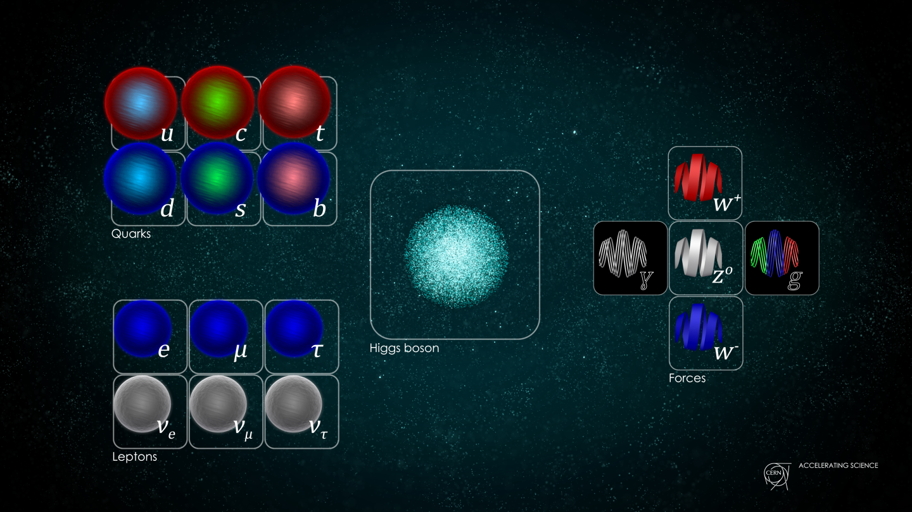
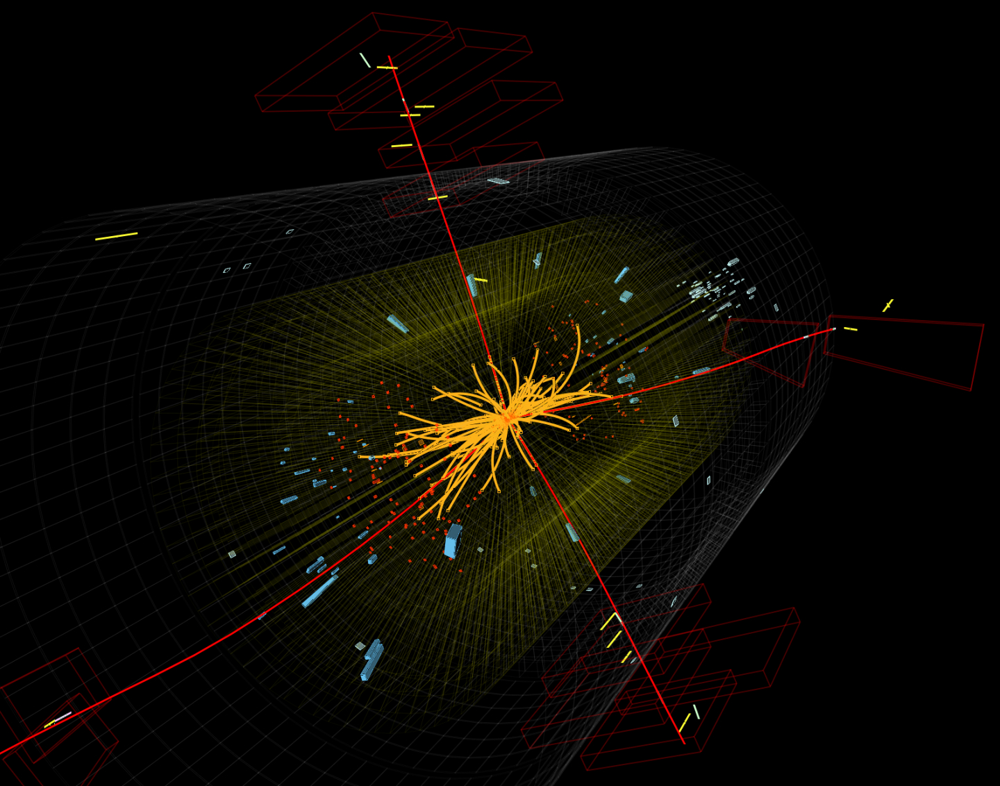
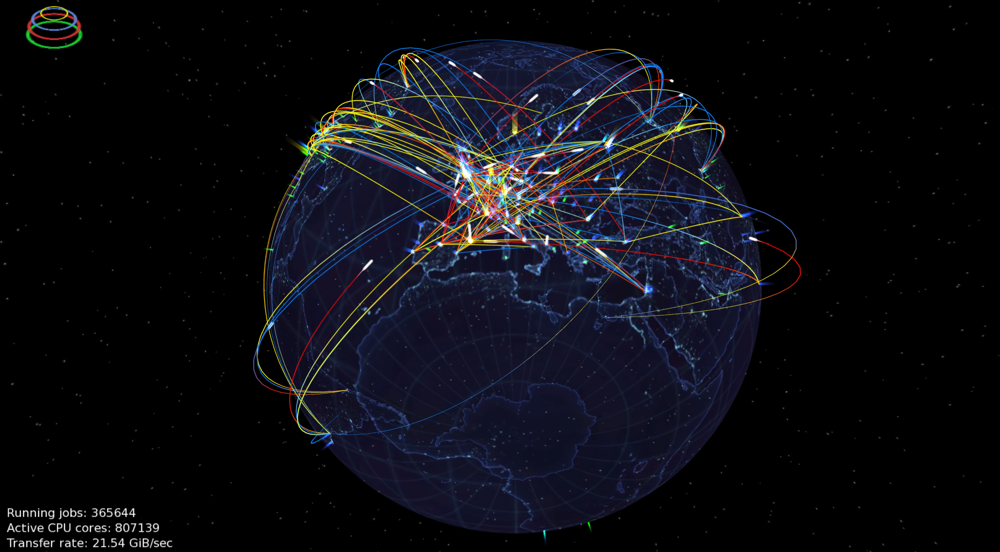
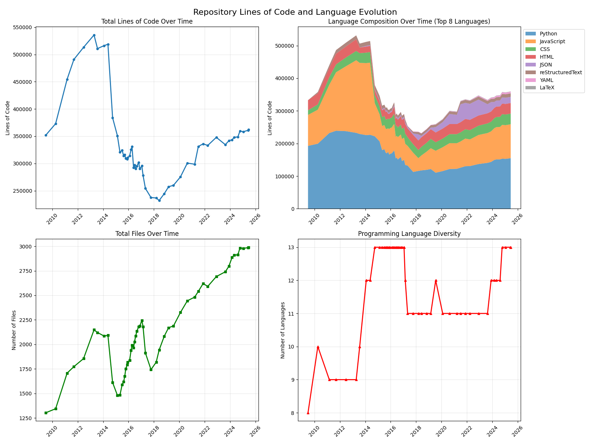
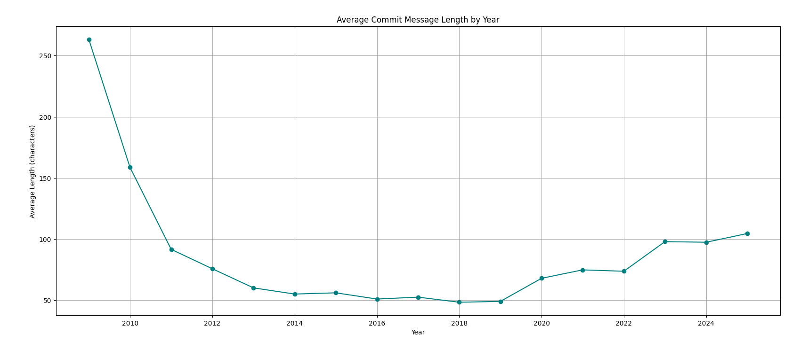
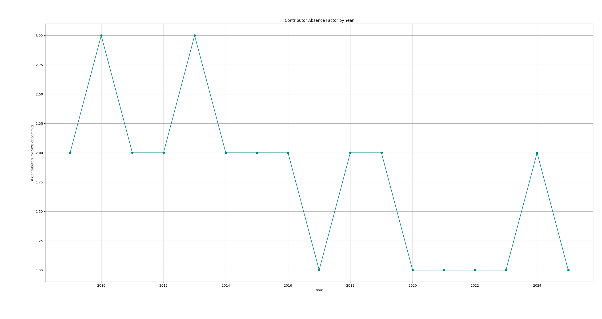
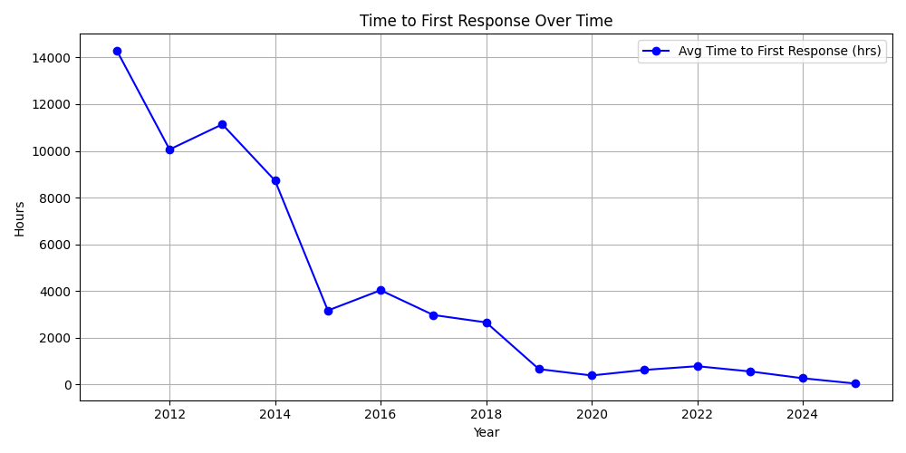
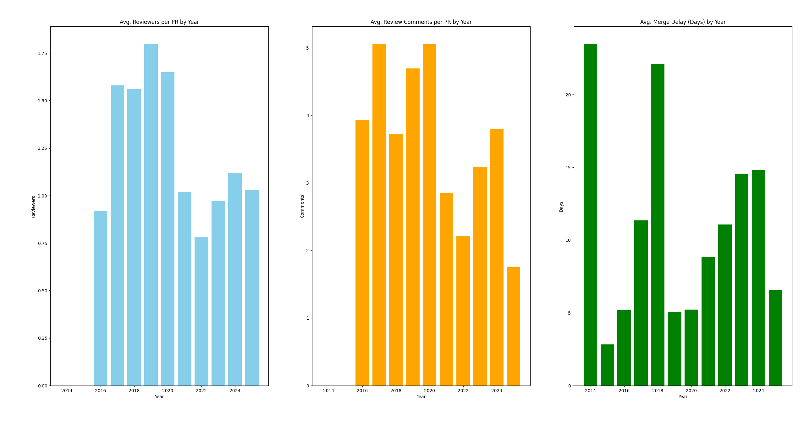
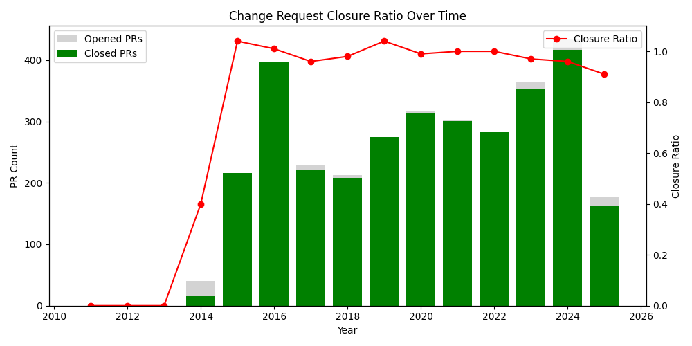

<!-- _paginate: false -->

_**Indico**: the 20 year history and evolution of an open-source project at **CERN**_

### Dominic Hollis & Tomas Roun - Indico Team (CERN)

<style scoped>
    section {
        justify-content: center !important;
        align-items: center !important;
        text-align: center !important;
    }

    h3 {
        color: #aaa;
        font-size: 0.8em;
        font-weight: normal;
    }
</style>
---

#TODO: Here be intro

---

<!-- # What is CERN?

CERN stands for the European Organization for Nuclear Research
It is the largest particle-physics laboratory in the world.
CERN's mission: study of fundamental particles -->


---

<!-- CERN Founded in 1954, located near Geneva, Switzerland
It is a large international collaboration. CERN currently has 24 member states, 10 associate member states and over 100 nationalities. There are 2500 members of staff and more than 12,000 visiting scientists -->


---

<!-- But what exactly do we do at CERN? -->


---


<!-- The LHC

The Large Hadron Collider is the largest particle accelerator in the world and the largest machine ever built. It is a circular tunnel 100 meteres underground.
The LHC has a circumefernce of 27 km and a diameter of about 8.5 km.

Protons and other particles are accelerated to almost the speed of light
before being collided. These collisions recreate conditions just after the Big Bang and are analyzed in gigantic detectors. -->

---


---

<!-- The detectors can be thought of as giant cameras that allow us to take pictures of the collisions and reconstruct what happened. During the collision, new particles are created. -->


---


<!-- # The Higgs Boson discovery -->

<!-- The missing piece the Standard Model of Particle physics

Particle reponsible for giving mass to other particles
Theorized in the 50s, finally observed by CERN in 2012 (Nobel Prize awarded a year later) Probably the biggest achievemnt of CERN to date -->


<!--  -->
<!--  -->

---

<!-- # The Computing Grid

The LHC generates Petabytes of data which need to be processed and analyzed.
To that end, CERN built the Worldwide LHC Computing Grid.

> The world's largest computing grid comprising over 170 computing facilities in a worldwide network across 42 countries

More than 1.4 million cores and 1.5 exabytes of storage  -->



---

<!-- # The Birth of the Web -->

<!-- Invented by Tim Berners-Lee at CERN (1989)
It’s a great example of fundamental science leading to unexpected innovation. -->


---


---

# Open Source at CERN

CERN has a long tradition of open science and open software

Open Data Portal,
ROOT, EOS, CTA, Zenodo, White Rabbit, Open Hardware License, ..

Many tools created at and for CERN find uses elsewhere
All research done at CERN is open and available

---

# Where does Indico fit in?

Born out of the need to manage scientific collaboration at an unprecedented scale

- TODO: Here we can continue with introducing Indico

---

# Indico

#TODO

---

# Evolution through the years

- Late 90’s/Early 00’s -> PHP + MySQL
- Early 00’s/Late 00’s -> mod_python + ZODB
- Late 00’s/Early 10’s -> flask + jQuery
- Nowadays -> React, flask + Postgres

#TODO add logos?

---

# Code Archeology - PHP

---


---

# Code Archeology - PHP

```php
function changePassword($userid, $password)
{
    $sql = "UPDATE user
            SET password='$password'
            WHERE id='$userid'";
    $db->query($sql);
}
```

This is _NOT_ a password hash, it is the actual password!
md5 _WAS_ used ... as a cache key

---

Set `$password` to `' OR '1'='1' --` to change everyone's password:

```sql
UPDATE user SET password='' OR '1'='1' --' WHERE id='$userid'
```

Or be a good hacker and drop the table to prevent leaking passwords:

```sql
UPDATE user SET password=''; DROP TABLE user; --' WHERE id='$userid'
```

---

# Code Archeology - Early Python days

###### Constructing HTML by hand


```python
edit = []
edit.append("""<a href='""")
edit.append(str(urlHandlers.UHConfModifBadgeDesign.getURL(dconf, templateId)))
edit.append("""'></a>&nbsp;""")
templateListHTML.append("".join(edit))
```

If you can't read it, that's the point

---

# ZODB

A Python pickle store

```python
class Account(Persistent):
    def __init__(self, balance):
        self.balance = balance

account = Account(42)
root.account = account
```

---

# ZODB

#TODO go trough the recording and see what P&A said about it

- No native support for indexes
- No consistency/constraints enforcement
- No fixed schema, so changing the implementation (adding/removing attributes, renaming classes) can cause unpickling to fail

OK for small projects, gets quite messy for large apps

https://news.ycombinator.com/item?id=6791293

---

# Homegrown state management UI framework

- Predates jQuery
- Kind of like React but worse (predates it by ~10 years)
    - Different terminology:
        - Draw vs Render
        - WatchValue vs State

---

###### Create observable values
```js
// Can also watch arrays, objects, etc..
const count = new WatchValue(0)

// Update value
count.set(1)

// Watch for changes
count.observe(v => console.log(v))
```

---

###### Construct HTML elements
```js
const count = new WatchValue(0)

Html.span(
    {style: {color: 'red'}},
    'The count is: ',
    count
)
```

---

```js
const count = new WatchValue(0)

const span = Html.span(
    {className: 'red'},
    'The count is: ',
    count
)

const btn = Html.button('Click me!')
btn.observeClick(() => {
    value.set(value.get() + 1)
})

value.observe(() => {
    console.log('Value changed')
})

return Html.span({}, span, btn)
```

---

<style scoped>
    .flex {
        margin: -40px;
        display: flex;
        justify-content: space-between;
        gap: 1em;
    }

    .flex > div {
        flex: 50%;
    }
</style>

<div class="flex">
<div>

```js
const count = new WatchValue(0)

const span = Html.span(
    {className: 'red'},
    'The count is: ',
    count
)

const btn = Html.button('Click me!')
btn.observeClick(() => {
    value.set(value.get() + 1)
})

value.observe(() => {
    console.log('Value changed')
})

return Html.span({}, span, btn)
```

</div>

<div>

```jsx
const [count, setCount] = useState(0)

useEffect(() => {
    console.log('Value changed')
}, [count])

return (
    <>
        <span>
            The count is: {count}
        </span>
        <button onClick={
            () => setCount(c => c+1)
        }>
            Click me!
        </button>
    </>
)
```

</div>
</div>

---

# Adopting React

<!-- Before: Jinja, reactivity handled by jQuery -->


---

<!-- "early adopters" - back when class components were the (only) standard -->


---

# Adopting React

**First steps**: Rewriting a separate module

<!-- self-contained SPA, great for testing out stuff -->
<!-- The team liked it so we decided to stick with it -->
<!-- Since then, all new features use React if possible -->
<!-- It was not possible rewrite all of Indico to React in one go, the switch is happening gradually -->
<!-- What helped a lot, is being able to mix Jinja and React on the same page -->


---

<!-- Header + sidebar rendered with Jinja, profile itself is written in React -->
<!-- React code also uses Rest endpoints returning JSON -->


---

# Jinja + React?

<!-- Jinja is used to render the header and sidebar -->
<!-- It also renders a container element with a predefined id -->

```html
<!-- user_profile.html -->
{{ render_header() }}
<div>
    {{ render_sidebar() }}
    <div id="user-profile"></div>
</div>
```

---

# Jinja + React?

<!-- The id is used by React to render inside the container element -->

```html
<!-- user_profile.html -->
{{ render_header() }}
<div>
    {{ render_sidebar() }}
    <div id="user-profile"></div>
</div>

<script>
    const container = document.querySelector('#user-profile')

    ReactDOM.render(
        <UserProfile/>,
        container
    )
</script>
```

---

<!-- Very successful adoption -->


---


 - **Event Management** System
 - **Collaborative effort** - MIT License
 - Core Developed at **CERN**
 - With contributions from the **United Nations**, **Max-Planck Institute for Physics** and many others!
 - **70+ developers** over the years

---


*The most popular event management system you never heard about*

 - **300+ servers**
 - **> 350K users**
 - Initial growth in research, but growing beyond it
   - [indico.un.org](https://indico.un.org)
   - [events.canonical.org](https://events.canonical.com/)
   - [indico.gnome.org](https://indico.gnome.org)
   - [lpc.events](https://lpc.events)

---

# Stats

Code in Git since 2009. Migrated to GitHub in early 2015.

---


---



---



---



---



---


---



---


---



---

# Lessons learned & Advice


---

# How do you stay motivated after so many years?

---

# How do you stay motivated after so many years?

> Indico's codebase is large and varied so no two days are the same

---

# How do you stay motivated after so many years?

> By seeing the impact of your work. Seeing people use your project and appreciate the work you've done.

---

# What advice would you give to other maintainers?

> Don’t underestimate the impact of writing that blog post, social media post or attending a conference

---

# What advice would you give to other maintainers?

> Keep the scope of the project in-mind. Do not blindy accept everything people ask for, especially if the maintenance burden is large.

---

# What advice would you give to other maintainers?

> Get some help - even if it is someone just looking at/filtering PRs, it can help a lot

---

<!-- _backgroundColor: "#002939ff" -->
<!-- _paginate: false -->


### 🌐 [getindico.io](https://getindico.io)
###  [@getindico](https://fosstodon.org/@getindico)
###  [@getindico](https://twitter.com/getindico)
###  [#indico:matrix.org](https://matrix.to/#/#indico:matrix.org)

<style scoped>
    p {
        text-align: middle;
    }

    img {
        vertical-align: middle;
    }

    a {
        color: #ffffff;
        text-decoration: none;
    }
</style>
