<!-- _paginate: false -->
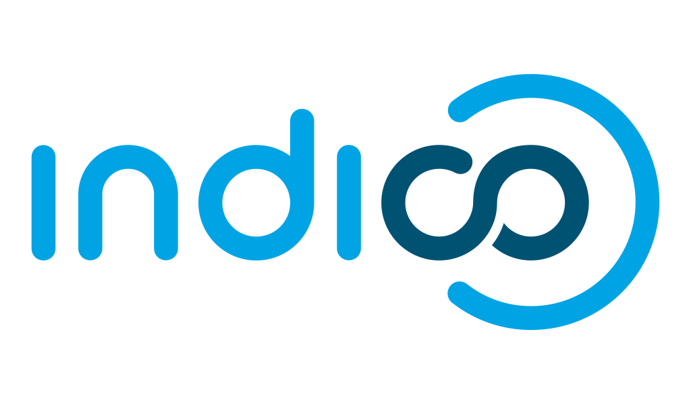
_**Indico**: the 20 year history and evolution of an open-source project at **CERN**_

### Dominic Hollis & Tomas Roun - Indico Team (CERN)

<!--
We'll tell you about Indico which is a large open-source
project we've been actively developing at CERN for more than two decades.

Indico is a general-purpose event management tool running
on Python and flask that lets
you organize all sorts of events, from meetings, lectures,
workshops, all the way to large conferences.

In fact, back in 2006 and 2007, Indico was used to EuroPython.
The one in 2006 was actually even hosted at CERN.
-->

---

# In this talk:

* What is Indico and what it can offer
* The tech behind Indico and how it's evolved
* A look at some repository metrics and what we can learn from them

<!--
- We're going to tell you about at its more than 20 year-long history as an open source project, show some cool tech that we are using and look at its evolution
with some fancy graphs

- But, first I wanted to tell you a bit about CERN, which is not only a really cool place to work but also a really interesting place to visit if you are into science.

 -->

---

# But first... what is CERN?

---

<!--
# CERN in pop culture

- In the opening scene of Angels and Demons when they steal the antimatter to blow up the Vatican
- In Steins Gate as a secret organization and the main antagonist
- Flashforwad - Sci-Fi novel about a an experiment at CERN going wrong which allows everybody to see themselves 20 years in the future

 -->

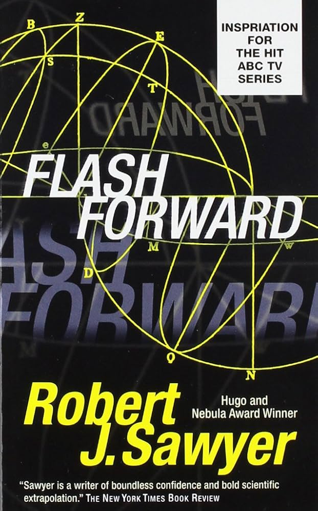

---

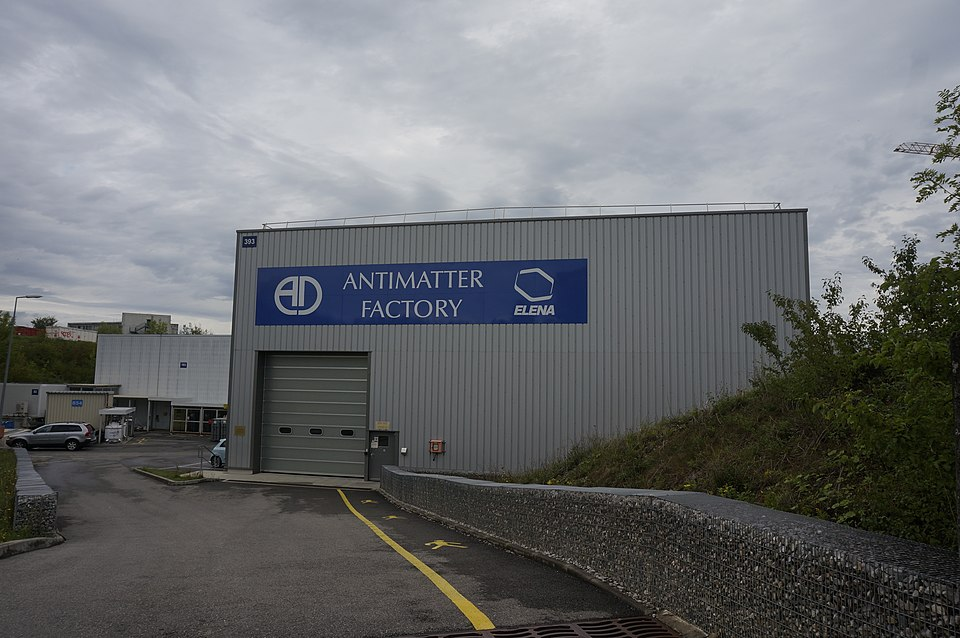

<!--
We do have an Antimatter factory though!
 -->

---

---

<!--
# What is CERN?

- European Organization for Nuclear Research
- Located near Geneva, Switzerland

- Mission: study of fundamental particles that make up matter

https://sce-dep.web.cern.ch/knowledge-centre/cern-numbers

-->

<!--  -->
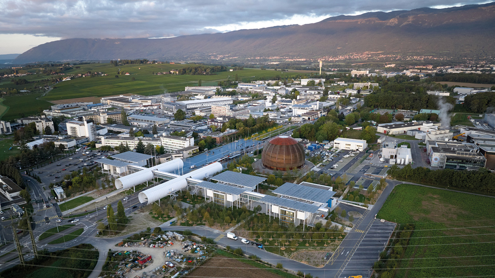

__Largest__ particle physics lab in the world

- __~6.2__ km² total area
- __~700__ buildings on multiple sites
- __2'500+__ members of staff
- __12'000+__ visiting scientists
- __150'000+__ visitors each year

---

# What do we do at CERN?

---

<!--
- This summarizes CERN in one picture
- Make particles like protons go very fast
- Make them collide
- Study what happens after
-->

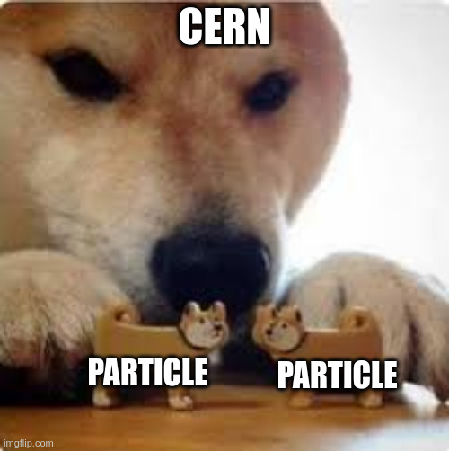

---

# The Large Hadron Collider

- The largest machine ever built
- __27km__ circumference
- __600 GWh__ per year power consumption
- __1.9 K (-271.3°C)__ operating temperature

<!-- 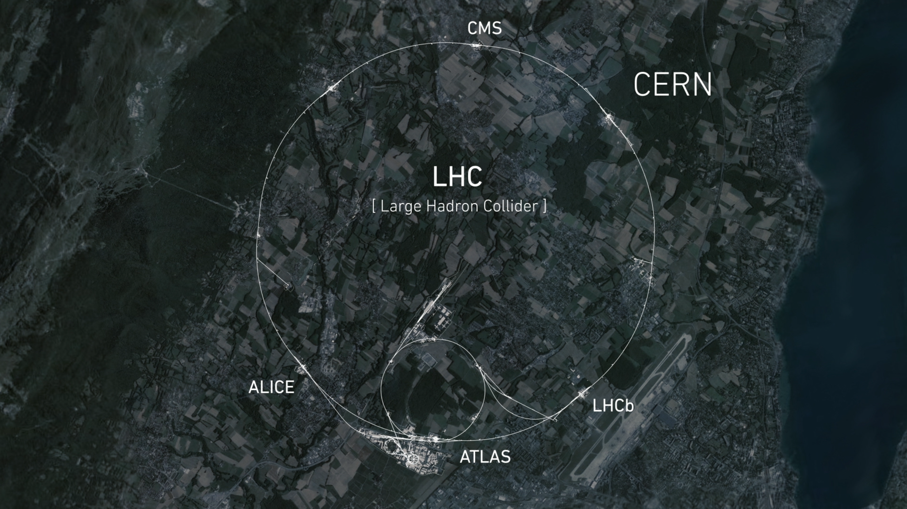 -->

<!--
# How do we accelerate and make the particles collide?

- Using something called a Particle Accelerator
- Specifically, the LHC - Large Hadron Collider
- The largest particle accelerator in the world
- The largest machine ever built
- A circular tunnel 100 meteres underground, circumefernce of 27 km and a diameter of about 8.5 km.

- Particles such as protons are accelerated to almost the speed of light
before being collided.
- These collisions recreate conditions just after the Big Bang. 

We even shut it down over Christmas

-->

---

<!-- 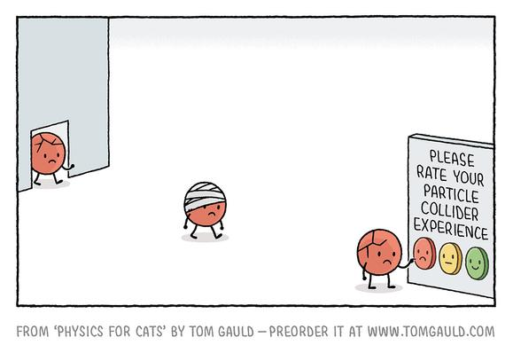

--- -->

<!--
# Detectors

- Collisions are analyzed using four detectors
- The detectors can be thought of as giant cameras that allow us to take pictures of the collisions and reconstruct what happened.
- During the collisions, new particles are created and sometimes we are lucky and see a new particle.

This is one of the 4 main detectors called ATLAS.
Person for scale

-->

---

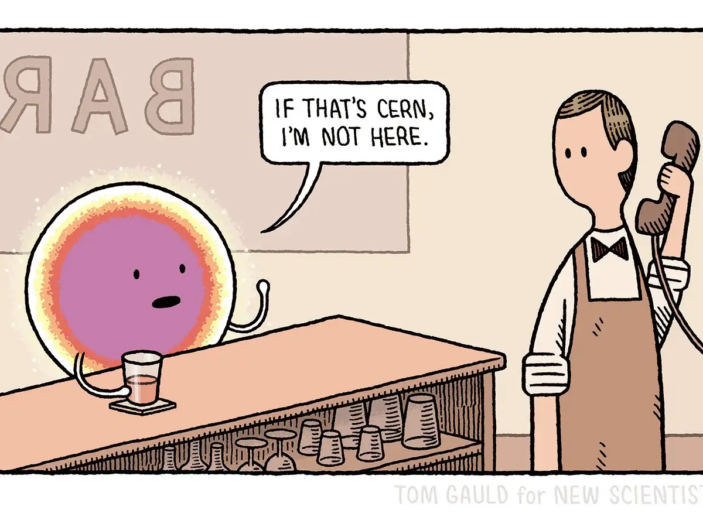

<!--
- Most famous discovery and of the most important scientific discoveries of this century.
- awarded with a Nobel prize
- The missing piece the Standard Model of Particle physics
- Theorized to exist decades ago, finally observed by CERN in 2012
- Only the LHC was large and powerful enugh to observe 'the Higgs' directly
-->

---

<!--
# CERN is not just doing Physics!

- Invented by Tim Berners-Lee at CERN (1989)
- Motivation was storing and finding documents and being able to share them with his collaborators
- great example of fundamental science leading to unexpected innovation
- really cool to just randomly stubmle upon this plaque while going for lunch
-->

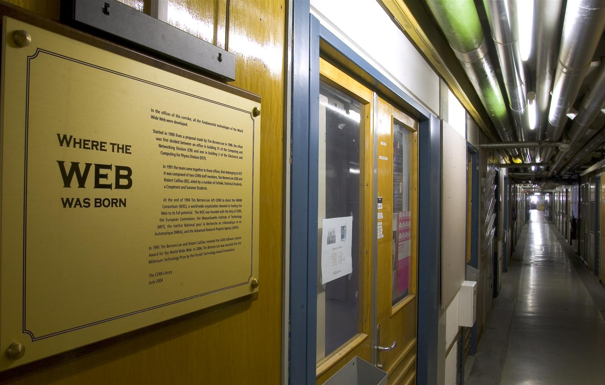

<!-- ---

- Tim is the only one who can righfully call himself a web developer

 -->

---

# CERN ❤️ Open Source & Open Science

  

    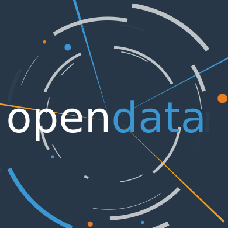</img>
  

  

    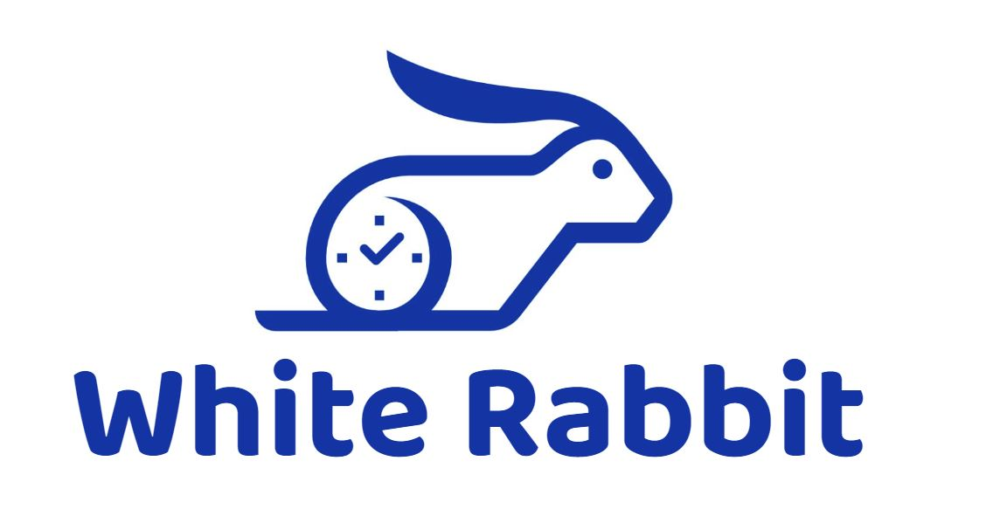</img>
  

  

    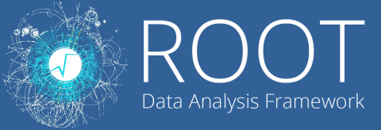</img>
    </img>
  

  

  

    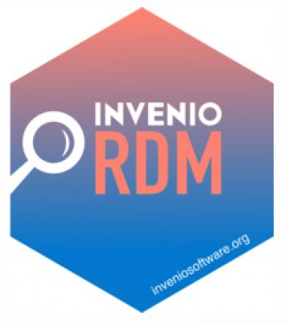</img>
  

  

    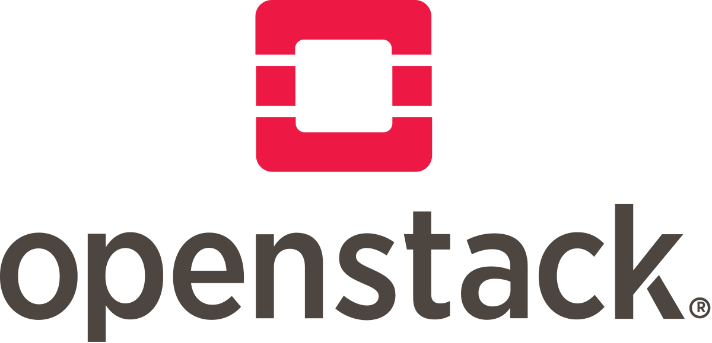</img>
  

  

    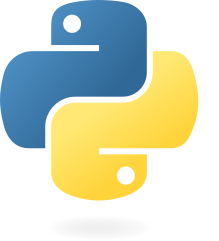</img>
  

  

    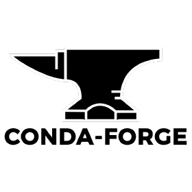</img>
  

  

    </img>
  

  

  

    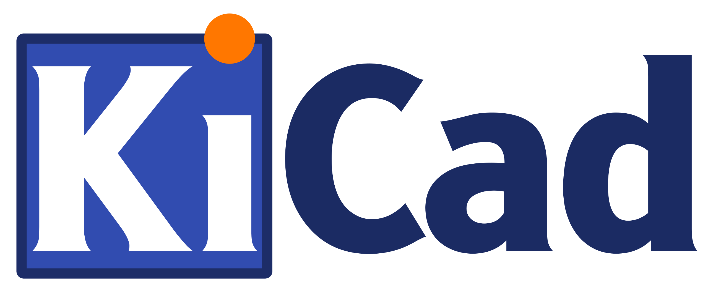</img>
  

<!--
- All research done at CERN is open and available - collistion data is freely available
- Long tradition of open science and open source

- ROOT - data analysis framework for HEP and more
- Zenodo - open source research repository

- CERN also contributes to a lot of projects that we rely on - OpenStack, KiCAD, matplotlib, ..
- We also rely heavily on Python for all sorts of things -> web applications, desktop applications, Machine learning, analyzing data from experiments and
random scripts that hold everything together

- White Rabbit - Sub-nanosecond synchronization of large distributed systems
- Many tools created at and for CERN find uses elsewhere

-->

---

# CERN ❤️ Open Source & Open Science

👉 https://opensource.cern/
👉 https://github.com/CERN/awesome-cern

<!--
If you wanna learn more about CERN and open source
Yes, CERN has the .cern TLD
 -->

---

<!-- TODO: Add a graphic of the timeline from CDSAgenda -> InDiCO -> Indico (today) -->

<!-- TODO: Add a slide on Flask-Multipass (and other specific Indico plugins) -->

# What is Indico?

---

# Meetings, conferences and more

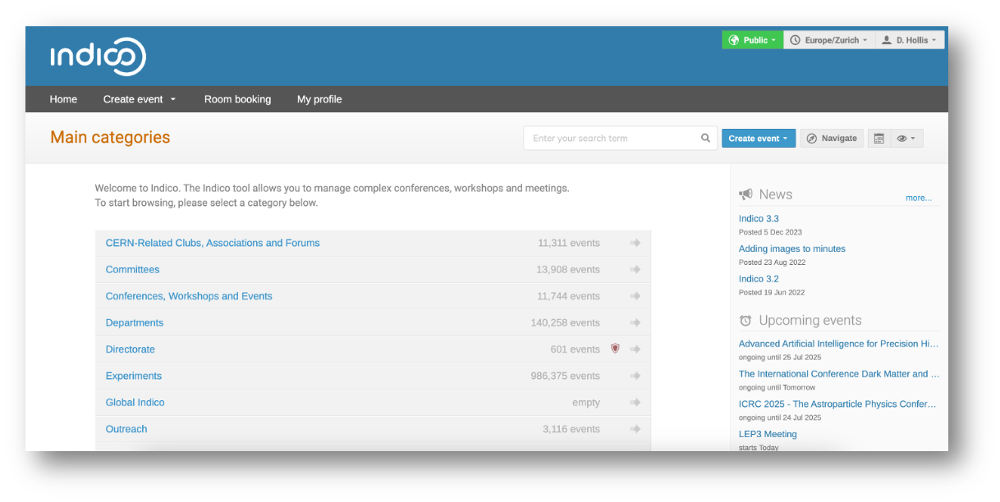

---

# Meetings, conferences and more

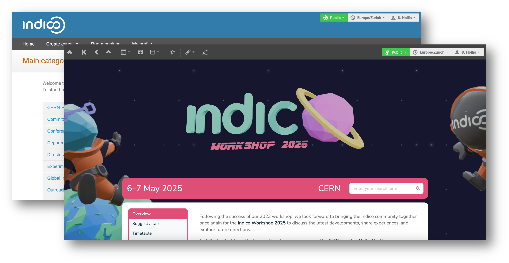

---

# Meetings, conferences and more

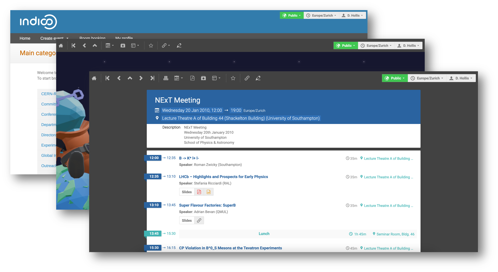

---

# Meetings, conferences and more

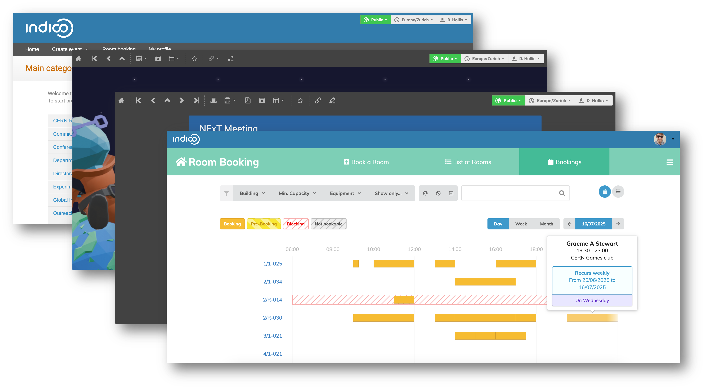

---

# As well as other interesting usecases...

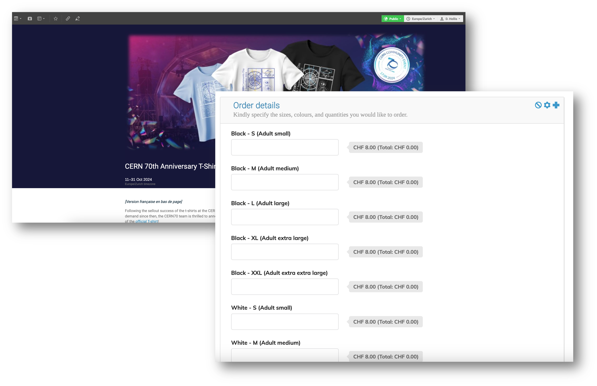

---

<!--
# Indico is a web application for managing events
- It is used to manage conferences, workshops, meetings, and other events
- It is used by CERN and many other institutions around the world
- It is open source and available on GitHub

-->

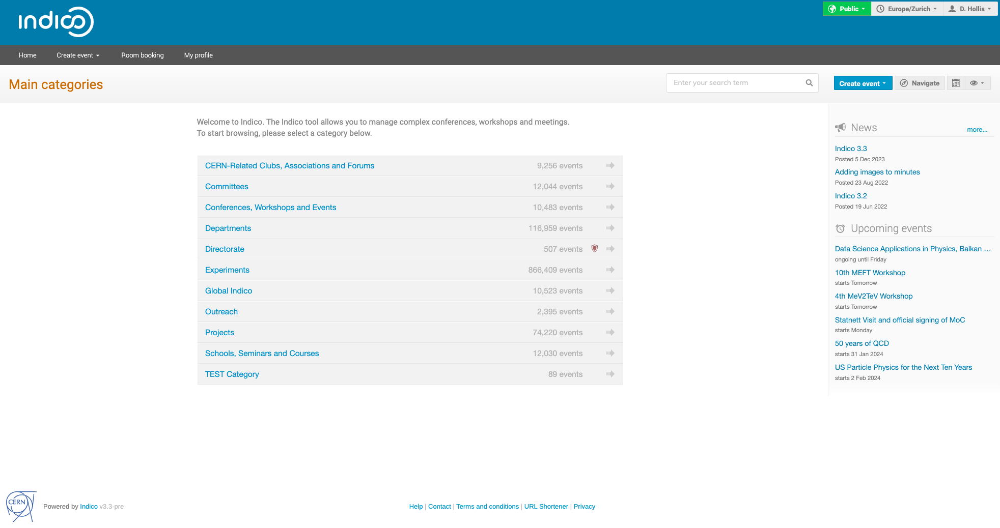

### 

 - **Event Management** System
 - **Collaborative effort** - MIT License
 - Core Developed at **CERN**
 - With contributions from the **United Nations**, **Max-Planck Institute for Physics** and many others!
 - **70+ developers** over the years

---
<!--
# Indico by the numbers
- 300+ servers
- 350K+ users
- 20 years of development
-->

<i>The most popular event management system you never heard about</i>

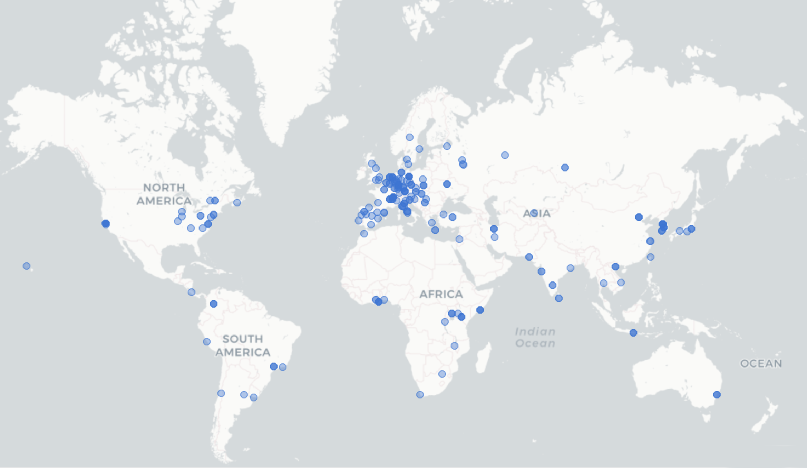

 - **300+ servers**
 - **> 350K users**
 - **20+ years** of development
 - Initial growth in research, but growing beyond it
   - [indico.un.org](https://indico.un.org)
   - [events.canonical.org](https://events.canonical.com/)
   - [indico.gnome.org](https://indico.gnome.org)
   - [lpc.events](https://lpc.events)

---

# Under the hood

---

<!--
# What powers Indico?
- Python 3
- Flask
- SQLAlchemy
- Jinja2
- PostgreSQL
- React (and a lot of JavaScript)
- And much much more!
-->

### We ❤️ Python

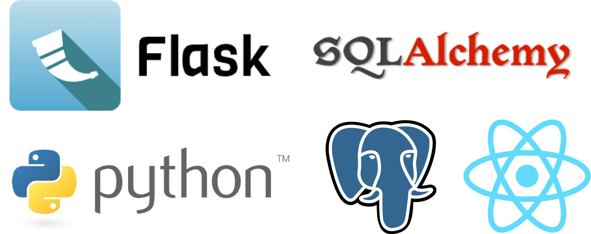

---

<!--
This is a Python conference so of course we eventually switched to Python
 -->

# How did we get here?

---

---
<!--
# 1999: CDSAgenda (AgendaMaker)
- CDSAgenda was the first event management system at CERN
- A solution to a problem of handling conferences and meetings by the different scientific collaborations at CERN
- It was called AgendaMaker at the time
- It was used to manage conferences and meetings at CERN
-->

# 1999: CDSAgenda (AgendaMaker)

- The go-to tool for managing conferences at CERN
- Written in PHP
- Used MySQL as a database
- Developed and maintained by a small in-house team at CERN (circa 1999)

---

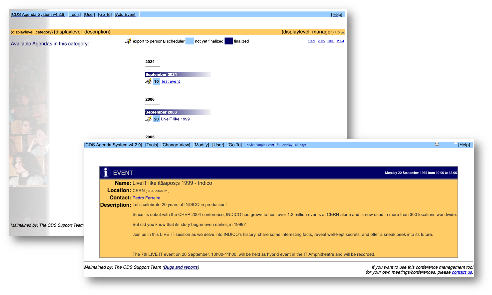

---

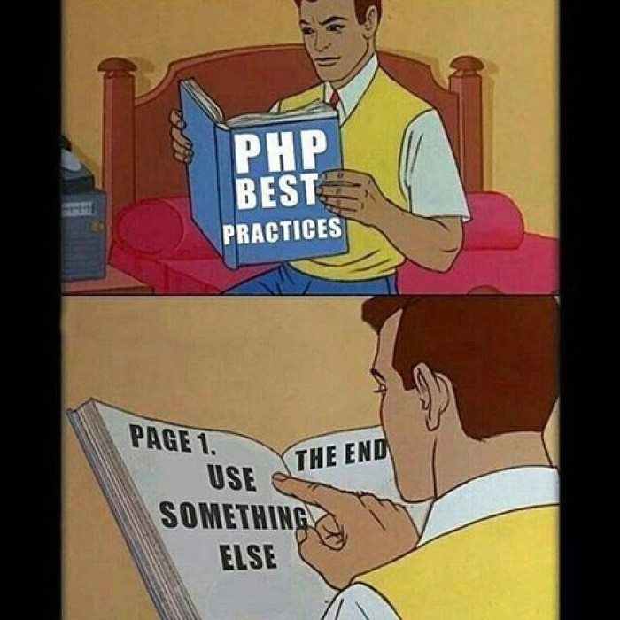

---
<!--
# 2000s: CDSAgenda -> InDiCo
- CDSAgenda was a great tool, but it was not flexible enough for the needs of CERN
- In 2002, the decision was made to rewrite it from scratch
- The new system was called InDiCo (Integrated Digital Conference)

-->

# 2000s: InDiCo (**In**tegrated **Di**gital **Co**nference)

- Wanted: a flexible "catch-all" event management system
- 🇪🇺 EU funded the development of InDiCo in 2002
- Written in Python
- `mod_python` ➡️ `mod_wsgi` (Apache) + ZODB (Zope* Object Database)
- Super-limited homemade templating engine
- First event in 2004: CHEP 2004 in 🇨🇭 Interlaken (Known as "Event 0")

<small>*Indico was the flagship Zope application of its time</small>

---

### We hosted EuroPython 🤯

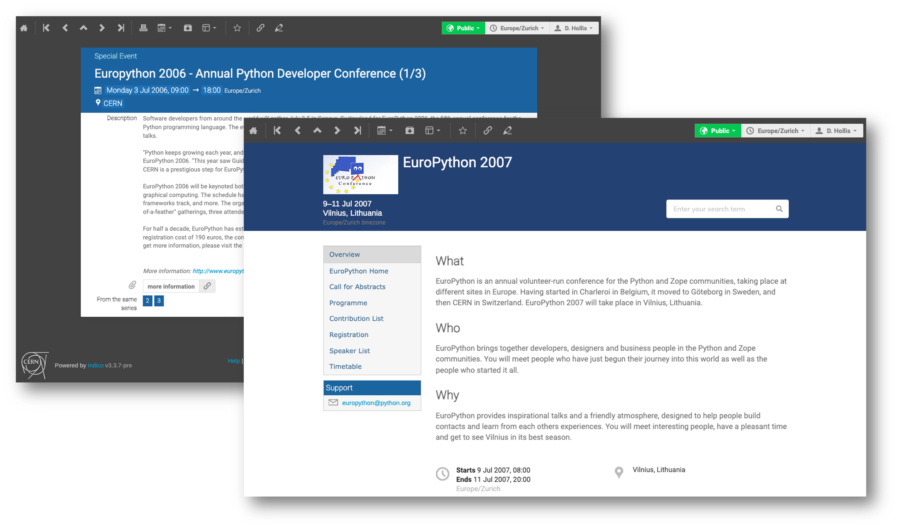

<small>Source: https://indico.cern.ch/e/430372 and https://indico.cern.ch/e/13919/</small>

---

# 2010 - 2013: Indico

- InDiCo became Indico around 2010 <!-- Ask Pedro for the exact date when this happened -->
- Adopted Flask
- Start using Flask sessions with Redis (less pressure on ZODB)

---
<!--
- We embraced PEP8
- Got rid of non-pythonic stuff (camelCase etc.)
- Legacy codebase was approx. 200K LOC
-->

# 2014 - 2017: Indico reborn

- ZODB was replaced with SQLAlchemy + PostgreSQL
  - Running ZODB & Postgres in parallel for a while
  - Storing users in Postgres and events in ZODB
- Replaced the old templating engine with Jinja2
- Rewrote 98% of the Python codebase

---

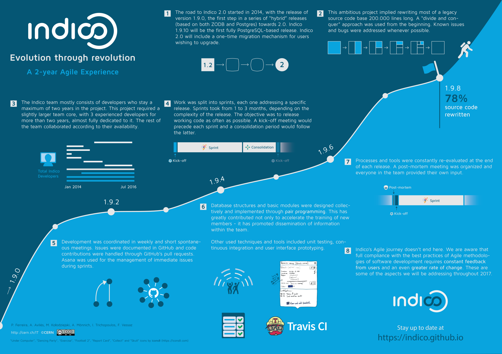

---
<!--
2021: In addition to Py 2->Py 3; we cleaned up the codebase a bit, this includes:
  - Modernizing OAuth authentication and token system using authlib
  - Introduced PAT (Personal Access Tokens) for API access in Indico

-->
# 2017 - Present: Highlights (Abridged)
- 2019: React added (🏠 New room booking interface)
- 2020: 🐍 Python 2 ➡️ Python 3
- 2022: ⚖️ Better privacy features (🇪🇺 GDPR)
- 2023: Document generation with `weasyprint`

---

# But wait, there's more!

---
<!--
# Flask-Multipass
- Written by the lead developer of Indico (Adrian Mönnich)
- Using `authlib` under the hood (anything OAuth related will work with it)
- Not specific to Indico, but used in Indico
-->

### Flask-Multipass
- Configure multiple user authentication methods simultaneously
- Supports OAuth, LDAP, SAML, Shibboleth and more

---
<!--
# js-flask-urls
- Demo'd at EuroPython 2019 (`useflask` or how to use a react frontend for your flask app)
- Small Python script to dump the URLs -> uses Babel to convert the import (JS) into a function definition
- You can learn more from Adrian's talk at EuroPython 2019 (Google/Bing/DuckDuckGo it)
-->

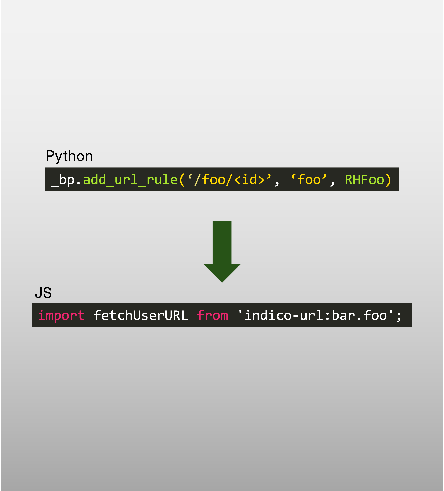
### js-flask-urls
- Generate URLs for your Flask routes in JavaScript
- No need to hardcode URLs in your JS code

---

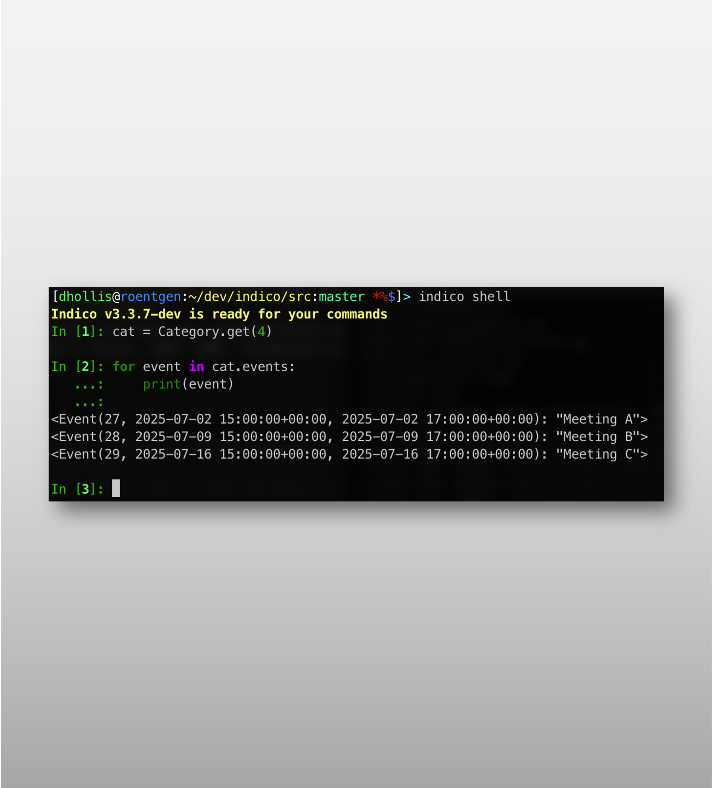
### Indico CLI (`indico`)
- Command-line interface for Indico
- Manage events, users, and more from the terminal
- A powerful tool for administrators and developers (e.g. `indico shell`)

---

# Measuring Open Source Project Health

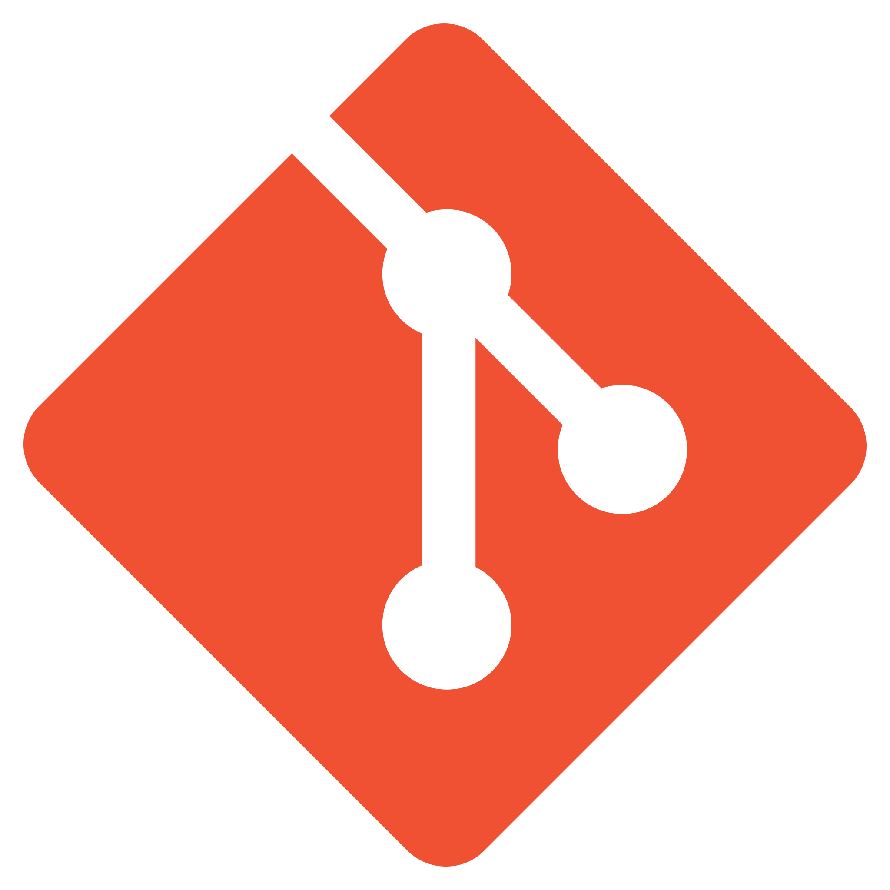

What can we learn from our git repo?

<!--
Now that we’ve looked at what Indico is and how it works under the hood,
let’s see what we can learn from at our git repository.

Git since 2009 -> migrated from CVS -> more than 15 years worth of data

There is a lot of things you can learn and a lot of trends you can spot by analyzing the git repository
I wanted to share a few graphs with you that we find interesting

- Repository health metrics - Dawn Foster
https://opensource.net/measure-open-source-project-health/
-->

<!-- `c5f733` awful hack, but it's only used in tests..
`bb23d2` A bit hacky, but the only quick way to do it now;
`d03345` Remove a rather terrible and unused JS file
`dc541e` Yes, we should use a proper extension point instead, but for now this fixes half the problem -->

---

# [chaoss.community](https://chaoss.community)

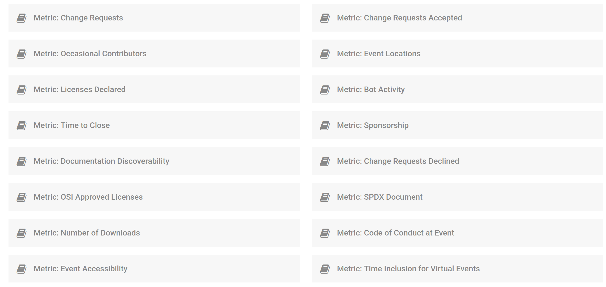

---

# Metrics

* Code evolution (size, languages)
* Technical debt and legacy code
* Contributors
* Bus factor
* Work-life balance

<!--
Picked out some metrics which are relevant to us but also very easy to measure (just need your git repo) and you
can still gain valuable insights from them
-->

---

<!--
LOC

- Huge drop around 2014: went from 500k down to less than 250k at some point
- Recently passed the LOC back from 2010

Language composition over time

interesting to try to reverse-engineer what happened

- Python dominates ever since the switch from PHP
- Huge drop in JS code around 2014 -> stopped vendoring JS dependencies and instead started using npm
- Lots of JSON around 2022 for some reason -> lockfile version upgrade from 2 to 3
https://github.com/indico/indico/pull/6225/files

- React keep growing

- Cannot afford to rewrite everything
- Lack of manpower
- Risk of introducing new bugs, especially for something that has been battle-tested by thousands of users over many years
- The old code has already worked all the kinks and bugs that you don't even know about
-->

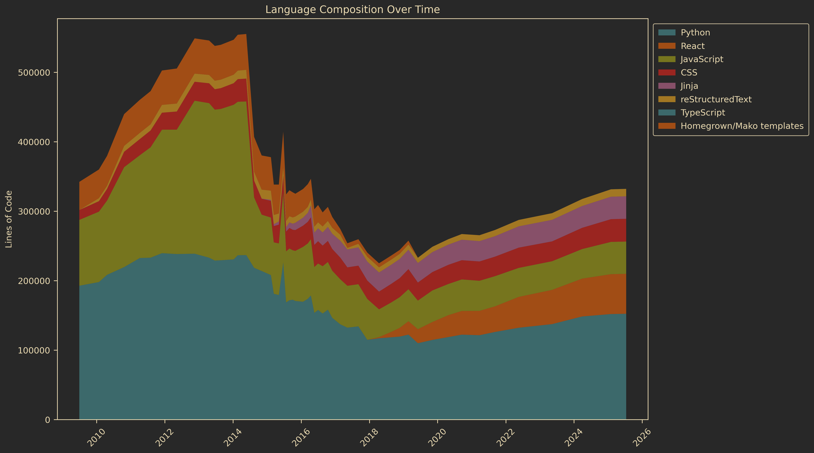

---

# Dealing with Technical Debt & Legacy Code

* How much legacy code do we have?
* How often does the code change?
* What are the modules that nobody wants to touch?

<!-- 
A project as old as Indico is bound to have some legacy code

Adding dependencies is easy, removing them is hard
-->

---

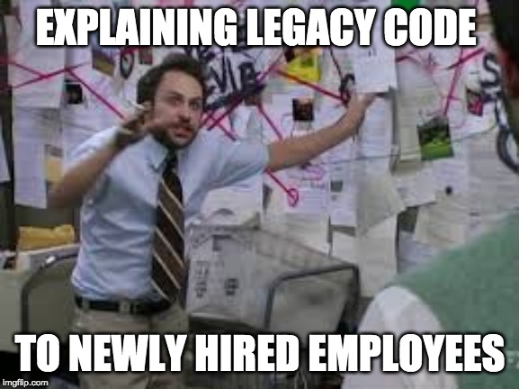

---

<!--
- Graph showing how long a line of code survives before it is removed or changed
- Every ~6 years Indico is rewritten
- Ship of Theseus - Indico of 6 years ago is not the Indico of today
- 6 years is a good number -> not too much code churn but at the same we're able to keep the codebase relatively modern
 -->

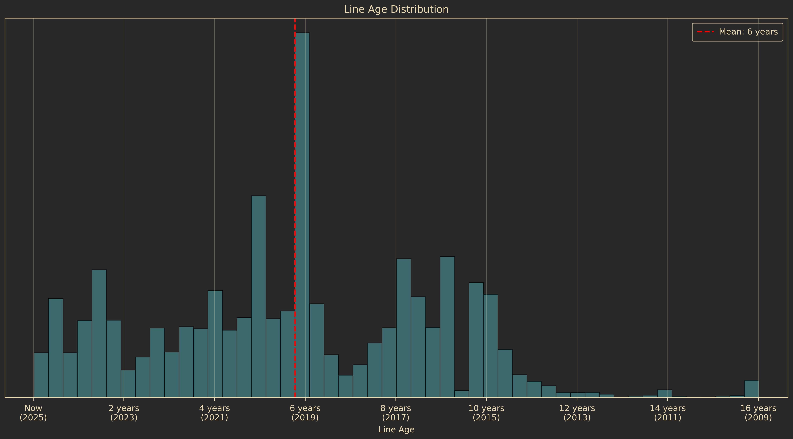

---

# Contributors

* Mainly developed by CERN, but...
* We get lots of contributions from other organizations & individuals

---

<!--
- To date almost 200 unique contributors
- Steady growth, 2025 is not over yet
- Averaging more than 10 new contributors per year for the last few years
- Started around 2020 == COVID confirmed
- Great given that Indico is a fairly complex application
- We will also gladly take your patches if it fixes a bug or adds a nice new feature

- Writing code and submitting pull requests is not the only way to contribute

 -->

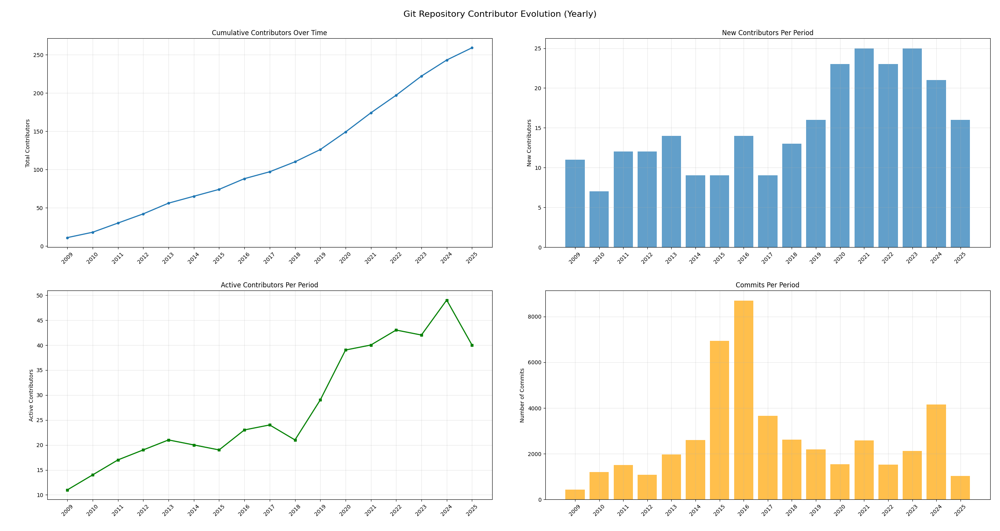

---

# There are many ways to contribute!

* Code
* Docs
* Design & Artwork
* Community building
* Just spreading the word

---

# Translations

<!-- 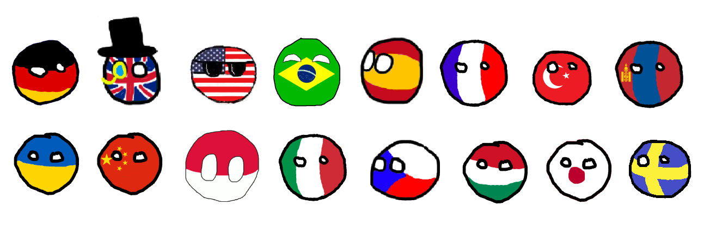 -->

🇬🇧 Welcome to Indico

🇩🇪 Willkommen bei Indico

🇪🇸 Bienvenidos a Indico

🇫🇷 Bienvenue dans Indico

🇮🇹 Benvenuti in Indico

🇭🇺 Üdvözöljük az Indico-ban

🇵🇱 Witaj w Indico

🇧🇷 Bem vindo ao Indico

🇸🇪 Välkommen till Indico

🇹🇷 Indico'ya hoşgeldiniz

🇨🇿 Vítejte v Indicu

🇲🇳 Индикод тавтай морил

🇺🇦 Ласкаво просимо до Indico

🇨🇳 欢迎使用 Indico。

🇯🇵 Indicoへようこそ。

<!--
Indico has a very active community of volunteer translators
it is thanks to them that Indico is available in more than 15 languages!
it is no small feat -> we have more than 6000 strings

There are also many languages that are currently in progress

We are always for volunteers to help out with the translations so if you
happen to be using Indico or you are just curious and want to help we'd
very grateful.

- mention community in general? Indico workshops?

- If any of the translations are wrong, you can help us fix them!
 -->

<!-- ---

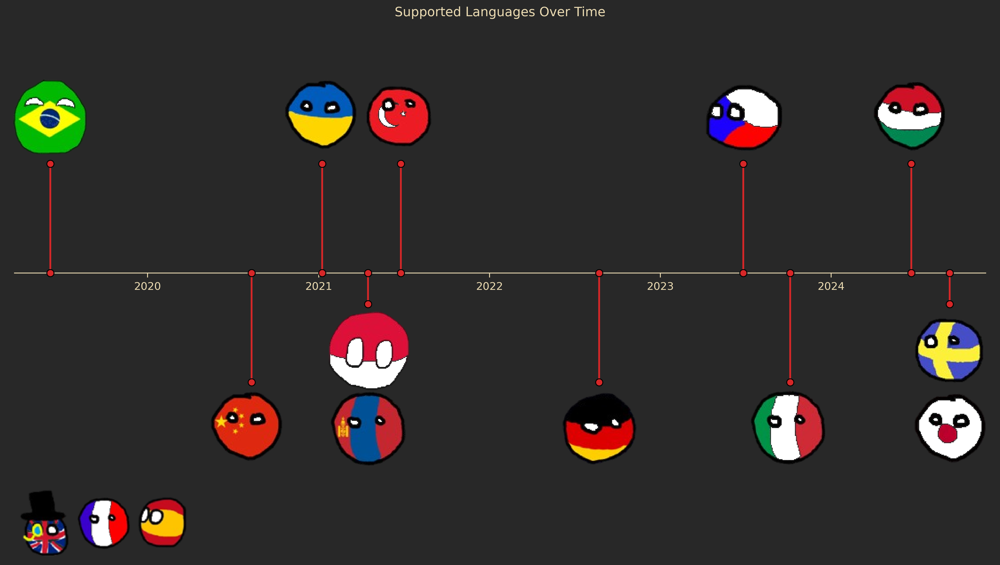 -->

---

<!--
What happens if the project lead gets hit by a bus or wins a lottery?
 -->

# Bus Factor

* Single point of failure
* Proxy for knowledge distribution within the team

---

<!--
- Started at 3 then 2 then 1 and recently we managed to get back to 2
- We recognize that we could be doing better in terms of diffusing institutional knowledge across multiple team members
 -->

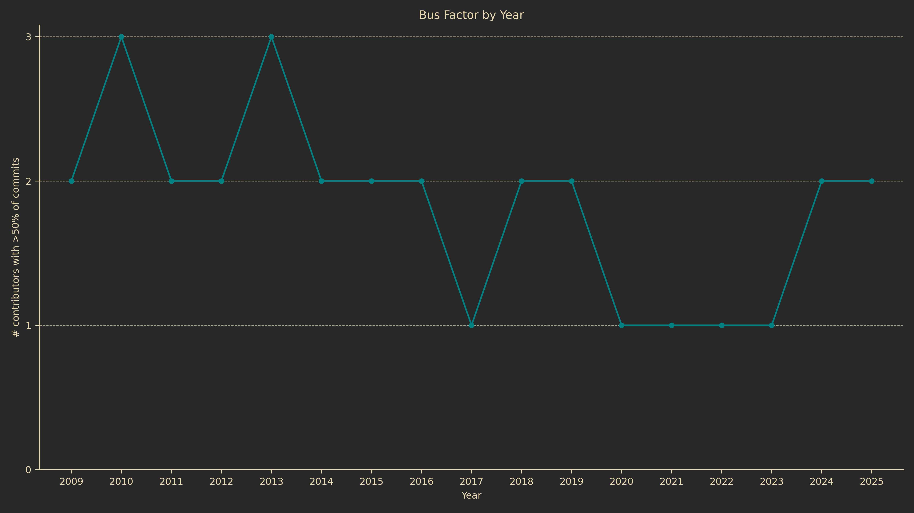

---

# Maintaining a healthy work-life balance

* Pressure to respond to issues/PRs
* Difficulty saying no to feature requests

---

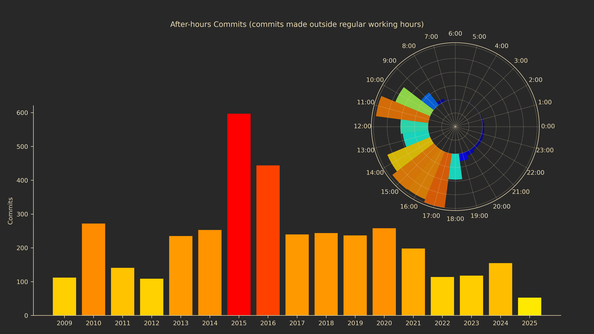

<!--
Doing good now but it wasn't always the case

- Maintaining a healthy work-life balance can be difficult at times
- We can get a good estimation of that by analyzing at what time code is committed throughout the day
- The main graph shows how many commits were made outside the regular working hours (basically 9-5)
- 2015 was a particulary difficult year, with a big rewrite of the app and a lot of all-nighters

Reasons:
- keep uptime high and not take indico down
- long DB migrations taking hours
- work on weekends was not common as people didnt normally work from home

- Happy to say that we have improved quite a lot since then and 2025 is looking much better

- it's also interesting to see breakdown of exactly when people tend to commit
- two times jump out -> just before lunch and just before going home
 -->

---

# To close it off...

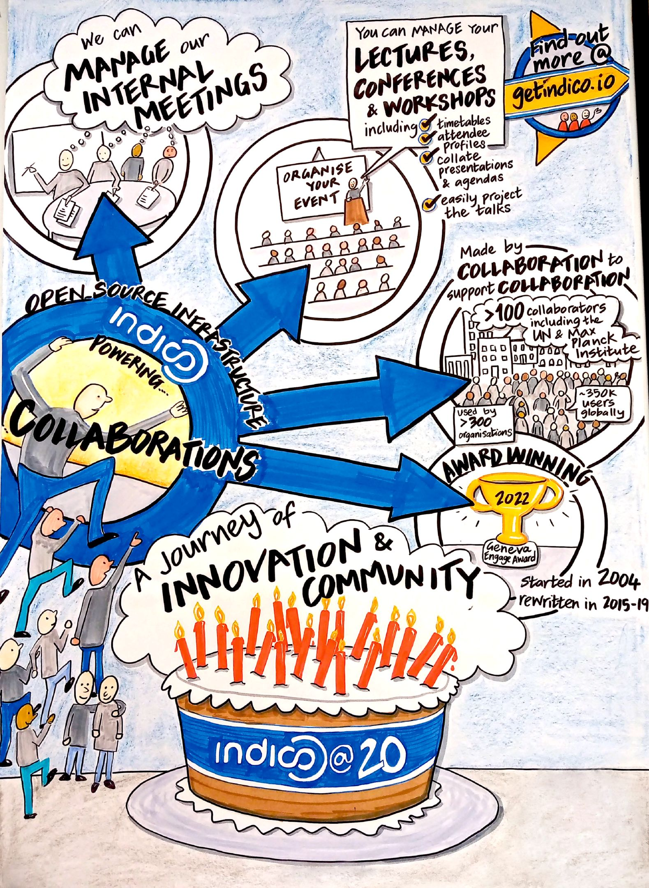

<!--
- Indico has been through many changes over the last (more than) two decades
- We've switched languages, technologies and databases countless times
- Who knows what we'll be using in 5, 10 years (going back to PHP? :D)

- Indico's success would've have been hard to pull off without the support from the community
and everybody who contributed in any shape or form
-->

---

# Get involved!

- Our GitHub 👉 [github.com/indico](github.com/indico)
- Translations 👉 [explore.transifex.com/indico/indico](https://explore.transifex.com/indico/indico/)

---

<!-- _backgroundColor: "#002939ff" -->
<!-- _paginate: false -->

### 🌐 [getindico.io](https://getindico.io)
###  [@getindico](https://fosstodon.org/@getindico)
###  [@getindico](https://twitter.com/getindico)
###  [#indico:matrix.org](https://matrix.to/#/#indico:matrix.org)

<!--
- Socials
- We have some merch!
 -->
