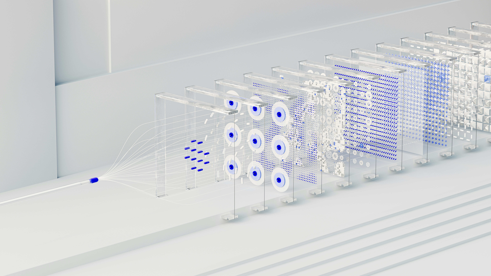
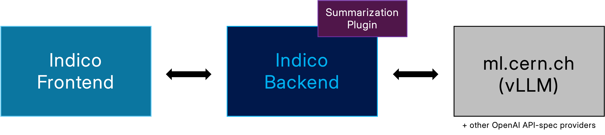

<!-- _footer: '' -->

---
<!-- _paginate: false -->

*Using LLMs: Summarization of meeting minutes in Indico*

### Dominic Hollis & Tomas Roun - Indico Team
### IT-CA Group Meeting - 21st Oct. 2025

---
<!-- _paginate: false -->

### The current problem

 - Users are compiling meeting minutes in Indico (great!)
 - ...just to send it to another meeting
 - Manually extracting relevant minutes is tedious
 - Trying to get a summary of the minutes is time-consuming

---
<!-- _paginate: false -->

### What can we do about it?

---
<!-- _paginate: false -->

### What can we do about it?

 - Abolish meetings? (not likely)

---
<!-- _paginate: false -->

### What can we do about it?

 - Abolish meetings? (not likely)
 - Hire more staff? (expensive)

---
<!-- _paginate: false -->

### What can we do about it?

 - Abolish meetings? (not likely)
 - Hire more staff? (expensive)
 - Use Large Language Models (LLMs) to summarize minutes? (interesting...)

---
<!-- _paginate: false -->

### What can we do about it?

 - Abolish meetings? (not likely)
 - Hire more staff? (expensive)
 - Use Large Language Models (LLMs) to summarize minutes? (interesting...)
 - Use emails instead? (nope)

---
<!-- _paginate: false -->

### What can we do about it?

 - ~~Abolish meetings? (not likely)~~
 - ~~Hire more staff? (expensive)~~
 - <strong>✅ Use Large Language Models (LLMs) to summarize minutes? (interesting...)</strong>
 - ~~Use emails instead? (nope)~~

---
<!-- _paginate: false -->

### Why LLMs?
- Powerful text processing capabilities
- Can generate human-like summaries
- Can be integrated into existing workflows
- Potential to save time and effort for users
---
<!-- _paginate: false -->

### Summer student project
- Idea proposed in early 2025
- Summer student: Zeynep Çaysar
- Masters A.I. student @ UZH
- Developed a prototype summarization feature
- Integrated with Indico's meeting minutes system
---
<!-- _paginate: false -->

# Demo
---
<!-- _paginate: false -->
### Overview

---
<!-- _paginate: false -->

### Future work
- Get this on prod by late 2025/early 2026
- Tweak mode (take a generated summary and ask for modifications)
- Maybe something else? 🤔

---
<!-- _backgroundColor: "#002939ff" -->
<!-- _paginate: false -->

### 🌐 [getindico.io](https://getindico.io)
###  [@getindico](https://fosstodon.org/@getindico)
###  [@getindico](https://twitter.com/getindico)
###  [#indico:matrix.org](https://matrix.to/#/#indico:matrix.org)

---
<!-- _paginate: false -->

### 📷 Image sources disclaimer
Images used in this talk - apart from Indico/CERN logos/branding, social media logos - are licensed under the [Unsplash License (longform below)](https://unsplash.com/license) and are free to use for commercial and non-commercial purposes.

> Unsplash grants you an irrevocable, nonexclusive, worldwide copyright license to download, copy, modify, distribute, perform, and use images from Unsplash for free, including for commercial purposes, without permission from or attributing the photographer or Unsplash. This license does not include the right to compile images from Unsplash to replicate a similar or competing service.

<small>Information correct at the time of writing (17th October 2025)</small>
