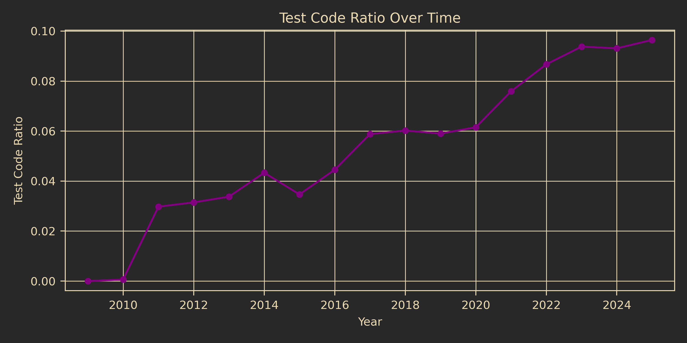
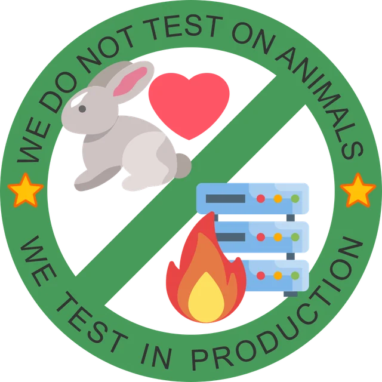

<!-- _paginate: false -->

_**Indico**: the 20 year history and evolution of an open-source project at **CERN**_

### Dominic Hollis & Tomas Roun - Indico Team (CERN)

---

# What is CERN?

---

<!--
# CERN in pop culture

- In the opening scene of Angels and Demons when they steal the anitmatter to blow up the Vatican
- Completely unrealistic, not possible to manufacture or store that amount of antimatter for that long

- In Steins Gate as a secret organization and the main antagonist
- Flashforwad - Sci-Fi novel about a an experiment at CERN going wrong which allows everybody to see themselves 20 years in the future

 -->

---

<!--
# What is CERN?

- European Organization for Nuclear Research
- Located near Geneva, Switzerland

- Largest particle-physics laboratory in the world
- Mission: study of fundamental particles that make up matter
- 2500+ members of staff and more than 12,000 visiting scientists
- ~700 buildings

https://sce-dep.web.cern.ch/knowledge-centre/cern-numbers

-->

<!--  -->

__Largest__ particle physics lab in the world

- __~6.2__ Square kilometers
- __~700__ buildings on multiple sites
- __2500+__ members of staff
- __12000+__ visiting scientists
- __150'000+__ visitors each year

---

# What exactly does CERN do?

---

<!--
- This summarizes CERN in one picture
- Take two particles and collide them with another
- Study the aftermath of the collision
-->

---

<!-- 

</img>

</img>

 -->

<!--
# How do we make the particles collide?

- Using something called a Particle Accelerator
- Specifically, the LHC - Large Hadron Collider
- The largest particle accelerator in the world
- The largest machine ever built
- A circular tunnel 100 meteres underground, circumefernce of 27 km and a diameter of about 8.5 km.

- Particles such as protons are accelerated to almost the speed of light
before being collided.
- These collisions recreate conditions just after the Big Bang. -->

---

<!-- 

--- -->

<!--
# Detectors

- Collisions are analyzed using four detectors
- The detectors can be thought of as giant cameras that allow us to take pictures of the collisions and reconstruct what happened.
- During the collisions, new particles are created and sometimes we are lucky and see a new particle.

-->

---

<!--
# The Higgs Boson discovery

- Most famous discovery and of the most important scientific discoveries of this century.
- awarded with a Nobel prize
- The missing piece the Standard Model of Particle physics
- Theorized to exist decades ago, finally observed by CERN in 2012
-->

---

<!--
# CERN is not just doing Physics!

- Invented by Tim Berners-Lee at CERN (1989)
- great example of fundamental science leading to unexpected innovation
- really cool to just randomly stubmle upon this plaque while going for lunch
-->

---

<!--

- Tim is the only one who can righfully call himself a web developer

-->

---

# CERN ❤️ Open Source

  </img>

  </img>

  </img>
  </img>

  </img>

  </img>

  </img>

  </img>

  </img>

<!--
- All research done at CERN is open and available
- Long tradition of open science and open source

- Open Data Portal - All collision data available for researchers
- ROOT - data analysis framework for HEP and more
- White Rabbit - Sub-nanosecond synchronization of large distributed systems

- Many tools created at and for CERN find uses elsewhere
- Check out the link to see more

-->

---

# CERN ❤️ Open Source

☛ https://opensource.cern/
☛ https://github.com/CERN/awesome-cern

<!--
If you wanna learn more about CERN and open source
Yes, CERN has the .cern TLD
 -->

---

<!-- TODO: Add a graphic of the timeline from CDSAgenda -> InDiCO -> Indico (today) -->

<!-- TODO: Add a slide on Flask-Multipass (and other specific Indico plugins) -->

# What is Indico?

---

<!--
# Indico is a web application for managing events
- It is used to manage conferences, workshops, meetings, and other events
- It is used by CERN and many other institutions around the world
- It is open source and available on GitHub

-->

### 

 - **Event Management** System
 - **Collaborative effort** - MIT License
 - Core Developed at **CERN**
 - With contributions from the **United Nations**, **Max-Planck Institute for Physics** and many others!
 - **70+ developers** over the years

---
<!--
# Indico by the numbers
- 300+ servers
- 350K+ users
- 20 years of development
-->

<i>The most popular event management system you never heard about</i>

 - **300+ servers**
 - **> 350K users**
 - **20+ years** of development
 - Initial growth in research, but growing beyond it
   - [indico.un.org](https://indico.un.org)
   - [events.canonical.org](https://events.canonical.com/)
   - [indico.gnome.org](https://indico.gnome.org)
   - [lpc.events](https://lpc.events)

---

# Under the hood

---

<!--
# What powers Indico?
- Python 3
- Flask
- SQLAlchemy
- Jinja2
- PostgreSQL
- React (and a lot of JavaScript)
- And much much more!
-->

### We ❤️ Python

---

<!--
This is a Python conference so of course we eventually switched to Python
 -->

---

 - **Event Management** System
 - **Collaborative effort** - MIT License
 - Core Developed at **CERN**
 - With contributions from the **United Nations**, **Max-Planck Institute for Physics** and many others!
 - **70+ developers** over the years

---

*The most popular event management system you never heard about*

 - **300+ servers**
 - **> 350K users**
 - Initial growth in research, but growing beyond it
   - [indico.un.org](https://indico.un.org)
   - [events.canonical.org](https://events.canonical.com/)
   - [indico.gnome.org](https://indico.gnome.org)
   - [lpc.events](https://lpc.events)

---

# Stats

Code in Git since 2009. Migrated to GitHub in early 2015.

<!--
- Repository health metrics - Dawn Foster
-->

---

<!--
LOC

- Huge drop around 2014: went from 500k down to less than 250k at some point
- Recently passed the LOC back from 2010

Language composition over time

interesting to try to reverse-engineer what happened

- Python dominates ever since the switch from PHP
- Huge drop in JS code around 2014
- Jinja/CSS stable
- Lots of JSON around 2022 for some reason -> lockfile version upgrade from 2 to 3
https://github.com/indico/indico/pull/6225/files

- React keep growing
-->

---

# Dealing with Technical Debt

---

<!--
- Graph showing how long a line of code survives before it is removed or changed
- Every ~6 years Indico is rewritten
- Ship of Theseus - Indico of 6 years ago is not the Indico of today
- 6 years is a good number -> not too much code churn but at the same we're able to keep the codebase relatively modern

Dealing with technical debt
- Context matters -> Indico is a large and mature applications that has been around for 20 years and probably will be here in another 20
- For such applications it's best to stick with proven and mature technologies as opposed to the hottest new framework
- e.g. we're using flask despite there being arguably more modern frameworks these days
- same for React, there are newer UI frameworks but we need to look 5/10/15 years in the future
- at the same, pragmatism beats purity
    - we still use jQuery in some parts, we'd like to get rid of it eventually but it works and the maintenance burden is low

- Cannot afford to rewrite everything
- Lack of manpower
- Risk of intrducing new bugs, especially for something that has been battle-tested by thousands of users over many years
- The old code has already worked all the kinks and bugs that you don't even know about
 -->

---

# Tests

---

<!--
- Far from the likes of Sqlite which have 10x the test as source code
- Clear upward movement

- Most of our code tests backend (i.e. Python)
- Used to have frontend tests based on Selenium
- Huge pain to maintain

https://github.com/indico/indico/commit/b1a3e14b90d16ad7883ed550081af54bdbb69bf8
 -->

---

<!--
- Nowadays we do manual testing
- We always release new features to our users at CERN fFirst before making a public release
- ~10k daily users are very good at finding bugs
-->

---

# Contributors

---

<!--
- To date almost 200 unique contributors
- Steady growth, 2025 is not over yet
- Averaging more than 10 new contributors per year for the last few years
- Started around 2020 == COVID confirmed
- Great given that Indico is a fairly complex application
- We will also gladly take your patches if it fixes a bug or adds a nice new feature

- Writing code and submitting pull requests is not the only way to contribute

 -->

---

# Translations

<!--  -->

🇬🇧 Welcome to Indico

🇩🇪 Willkommen bei Indico

🇪🇸 Bienvenidos a Indico

🇫🇷 Bienvenue dans Indico

🇮🇹 Benvenuti in Indico

🇭🇺 Üdvözöljük az Indico-ban

🇵🇱 Witaj w Indico

🇧🇷 Bem vindo ao Indico

🇸🇪 Välkommen till Indico

🇹🇷 Indico'ya hoşgeldiniz

🇨🇿 Vítejte v Indicu

🇲🇳 Индикод тавтай морил

🇺🇦 Ласкаво просимо до Indico

🇨🇳 欢迎使用 Indico。

🇯🇵 Indicoへようこそ。

---

<!--
Over 6000 phrases
 -->

---

<!--
- Very happy I wasn't around at that time
 -->

---

<!--
This is what our senior colleagues look like when we mention 2015
 -->

---

# Lessons learned & Advice

---

# How do you stay motivated after so many years?

---

# How do you stay motivated after so many years?

> By seeing the impact of your work. Seeing people use your project and appreciate the work you've done.

---

# What advice would you give to other maintainers?

> Keep the scope of the project in-mind. Do not blindy accept everything people ask for, especially if the maintenance burden is large.

---

# What advice would you give to other maintainers?

> Get some help - even if it is someone just looking at/filtering PRs, it can help a lot

---

<!-- _backgroundColor: "#002939ff" -->
<!-- _paginate: false -->

### 🌐 [getindico.io](https://getindico.io)
###  [@getindico](https://fosstodon.org/@getindico)
###  [@getindico](https://twitter.com/getindico)
###  [#indico:matrix.org](https://matrix.to/#/#indico:matrix.org)

