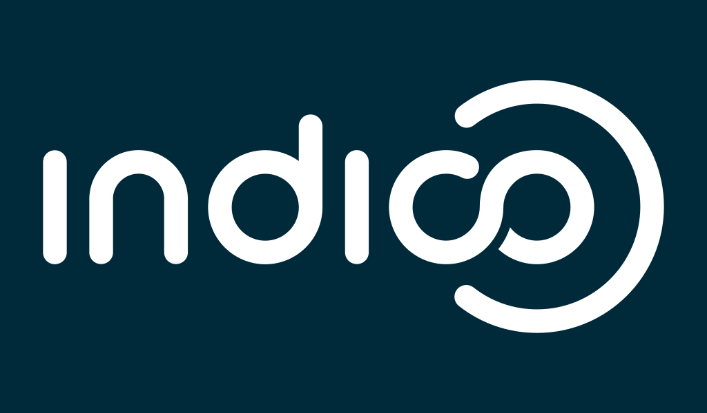

<!-- _footer: '' -->

<!-- _backgroundColor: "#0033A0" -->

---

*Rewriting the Indico check-in app*

### Dominic Hollis - Indico Team (CERN)

---

### What is the check-in app?

 - Helps organizers manage attendee check-in at events
 - Used at CERN for (major) conferences
 - Used at other institutions (e.g. UNOG etc.)
 - Does what it says on the tin

---

### Legacy check-in app

 - Built in 2013 (and continued to be developed till 2015)
 - Based on AngularJS
 - Uses Cordova to build for iOS and Android
 - Showing its age
 - Hard to maintain

---

### Check-in App (PWA)

---

### [getindico.io](https://getindico.io)
####  [@getindico](https://twitter.com/getindico)

---

<!-- _footer: '' -->
<!-- _paginate: false -->

<!-- _backgroundColor: "#002939ff" -->

