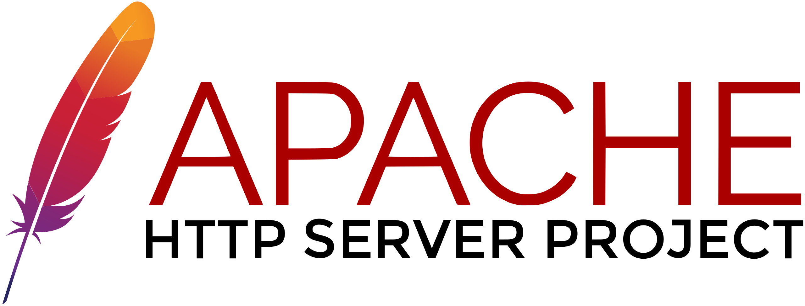
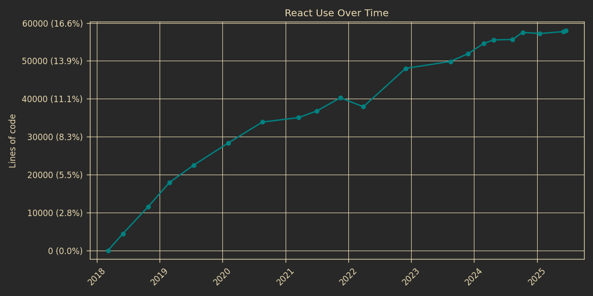

<!-- _paginate: false -->

_**Indico**: the 20 year history and evolution of an open-source project at **CERN**_

### Dominic Hollis & Tomas Roun - Indico Team (CERN)

<style scoped>
    section {
        justify-content: center !important;
        align-items: center !important;
        text-align: center !important;
    }

    h3 {
        color: #aaa;
        font-size: 0.8em;
        font-weight: normal;
    }
</style>
---

#TODO: Here be intro


---

# What is CERN?

---

<!--
# CERN in pop culture

- In the opening scene of Angels and Demons when they steal the anitmatter to blow up the Vatican
- Completely unrealistic, not possible to manufacture or store that amount of antimatter for that long

- In Steins Gate as a secret organization and the main antagonist

 -->


---

<!--
# What is CERN?

- European Organization for Nuclear Research

- Largest particle-physics laboratory in the world
- Located near Geneva, Switzerland
- 2500+ members of staff and more than 12,000 visiting scientists

- CERN's mission: study of fundamental particles that make up matter (and antimatter)

-->


---

# What exactly does CERN do?

---

<!--
- This summarizes CERN in one picture
- Take two particles and collide them with another
- Study the aftermath of the collision
-->


---


<!--
# How do we make the particles collide?

- Using something called a Particle Accelerator
- Specifically, the LHC - Large Hadron Collider
- The largest particle accelerator in the world
- The largest machine ever built
- A circular tunnel 100 meteres underground, circumefernce of 27 km and a diameter of about 8.5 km.

- Particles such as protons are accelerated to almost the speed of light
before being collided.
- These collisions recreate conditions just after the Big Bang. -->

---


---

<!--
# Detectors

- Collisions are analyzed using four detectors
- The detectors can be thought of as giant cameras that allow us to take pictures of the collisions and reconstruct what happened.
- During the collisions, new particles are created and sometimes we are lucky and see a new particle.

-->


---


<!--
# The Higgs Boson discovery

- Most famous discovery
- The missing piece the Standard Model of Particle physics
- Theorized to exist decades ago, finally observed by CERN in 2012
-->

---

<!--
# CERN is not just doing Physics!

- Invented by Tim Berners-Lee at CERN (1989)
- great example of fundamental science leading to unexpected innovation
- really cool to just randomly stubmle upon this plaque while going for lunch
-->


---

<!--

- Tim is the only one who can righfully call himself a web developer

-->


---

# Open Source at CERN

<style scoped>
    .flex {
        display: flex;
        align-items: center;
        gap: .5em;
        margin-bottom: 2em;
    }

    .flex img {
        height: auto;
        width: auto;
        max-width: 300px;
        max-height: 300px;
    }
</style>

<div class="flex">

<div>
  </img>
</div>
<div>
  </img>
</div>
<div>
  </img>
  </img>
</div>
<div>
</div>
  </img>
</div>

☛ https://github.com/CERN/awesome-cern

#TODO waiting for Giacomo to get back with a list

<!--
- All research done at CERN is open and available
- Long tradition of open science and open source

- Open Data Portal - All collision data available for researchers
- ROOT - data analysis framework for HEP and more
- White Rabbit - Sub-nanosecond synchronization of large distributed systems

- Many tools created at and for CERN find uses elsewhere
- Check out the link to see more

-->

---

# Where does Indico fit in?

Born out of the need to manage scientific collaboration at an unprecedented scale

- TODO: Here we can continue with introducing Indico

---

# Indico

#TODO

---

# Indico's evolution through the years

<!--
Indico has changed a lot over the last >20 years
-->

---

# Late 90’s/Early 00’s

<style scoped>
    .flex {
        display: flex;
        align-items: center;
        gap: .5em;
        margin-bottom: 2em;
    }

    .flex img {
        height: auto;
        width: auto;
        max-width: 500px;
        max-height: 300px;
    }
</style>

<div class="flex">

<div>
  </img>
</div>
<div>
  </img>
</div>
</div>

---

# Code Archeology

```php
function changePassword($userid, $password)
{
    $sql = "UPDATE user
            SET password='$password'
            WHERE id='$userid'";
    $db->query($sql);
}
```
<!--

- What's wrong with this code?

- This is _NOT_ a password hash, it is the actual password!
- md5 _WAS_ used ... as a cache key

-->

---

```php
function changePassword($userid, $password)
{
    $sql = "UPDATE user
            SET password='$password'
            WHERE id='$userid'";
    $db->query($sql);
}
```

Set `$password` to `' OR '1'='1' --` to change everyone's password:

```sql
UPDATE user SET password='' OR '1'='1' --' WHERE id='$userid'
```

---

```php
function changePassword($userid, $password)
{
    $sql = "UPDATE user
            SET password='$password'
            WHERE id='$userid'";
    $db->query($sql);
}
```

Or be a good hacker and drop the table to prevent leaking passwords:

```sql
UPDATE user SET password=''; DROP TABLE user; --' WHERE id='$userid'
```

---


---

# Early 00’s/Late 00’s

<style scoped>
    .flex {
        display: flex;
        align-items: center;
        justify-content: space-around;
    }

    .center {
        justify-content: center;
        margin-bottom: 2em;
    }

    .flex img {
        height: auto;
        width: auto;
        max-width: 500px;
        max-height: 300px;
    }
</style>

<div class="flex center">
  </img>
</div>

<div class="flex">

<div>
  </img>
</div>
<div>
  </img>
</div>
</div>

---

# Code Archeology - Early Python days

<!--
Constructing HTML by hand

The dark ages before templating engines

If you can't read it, that's the point

And we used to use camelCase
-->


```python
edit = []
edit.append("""<a href='""")
edit.append(str(urlHandlers.UHConfModifBadgeDesign.getURL(dconf, templateId)))
edit.append("""'></a>&nbsp;""")
templateListHTML.append("".join(edit))
```

---

# Code Archeology - ZODB

<!--
#TODO go trough the recording and see what P&A said about it

- Quite popular at the time, around Python 2.5/2.6
- Essentially a Python pickle store
- Very easy to store Python objects

Some downsides (at least at the time)
- No indexes
- No replication
- No fixed schema
- Changing the implementation (adding/removing attributes, renaming classes) can cause unpickling to fail

-->

```python
class Account(Persistent):
    def __init__(self, balance):
        self.balance = balance

account = Account(42)
root.account = account
```

---

# Homegrown reactive UI framework

* Similar to React (predates it by ~7 years)
* Different terminology:
    - __Draw__ vs __Render__
    - __WatchValue__ vs __State__

<!--
Otherwise very similar under the hood
-->

---

# Quick demo

###### Create observable values
```js
// Can also watch arrays, objects, etc..
const count = new WatchValue(0)

// Update value
count.set(1)

// Watch for changes
count.observe(v => console.log(v))
```

---

###### Construct HTML elements
```js
const count = new WatchValue(0)

Html.span(
    {style: {color: 'red'}},
    'The count is: ',
    count
)
```

---

# Simple click counter

```js
const count = new WatchValue(0)

const span = Html.span(
    {className: 'red'},
    'The count is: ',
    count
)

const btn = Html.button('Click me!')
btn.observeClick(() => {
    value.set(value.get() + 1)
})

value.observe(() => {
    console.log('Value changed')
})

return Html.span({}, span, btn)
```

---

<style scoped>
    .flex {
        margin: -40px;
        display: flex;
        justify-content: space-between;
        gap: 1em;
    }

    .flex > div {
        flex: 50%;
    }
</style>

<div class="flex">
<div>

```js
const count = new WatchValue(0)

const span = Html.span(
    {className: 'red'},
    'The count is: ',
    count
)

const btn = Html.button('Click me!')
btn.observeClick(() => {
    value.set(value.get() + 1)
})

value.observe(() => {
    console.log('Value changed')
})

return Html.span({}, span, btn)
```

</div>

<div>

```jsx
const [count, setCount] = useState(0)

useEffect(() => {
    console.log('Value changed')
}, [count])

return (
    <>
        <span>
            The count is: {count}
        </span>
        <button onClick={
            () => setCount(c => c+1)
        }>
            Click me!
        </button>
    </>
)
```

</div>
</div>

---

# Late 00’s/Early 10’s

- #TODO something about flask?

---

# What we're using these days

- Happily using React, flask and Postgres

<!--
- Prefer stable and realiable tech

 -->

---

# Adopting React

<!--
Before: Jinja templates, reactivity handled by jQuery

Around 2018 when React started to take off
-->


---

<!--
"early adopters" - back when class components were the (only) standard

-->


---

# Adopting React

**First steps**: Rewriting a separate module

<!--
Indico's room booking module

- Self-contained SPA, allows us to test stuff in isolation
- The team liked it so we decided to stick with it

- All new features use React if possible
- Not possible rewrite all of Indico to React in one go, the switch is happening gradually

-->


---

<!--
- Needed to find a way to mix Jinja and React on the same page
- Typically react apps are SPAs but that was not feasible in our case

Example:
- Header + sidebar rendered with Jinja
- Profile itself is written in React
- React code uses REST APIs returning JSON
- Will make it easier to switch to something else if needed

-->


---

# Jinja + React?

<!--
- This is the profile page expressed in code

- Jinja is used to render the header and sidebar
- A container with a unique id is added
-->

```html
<!-- user_profile.html -->
{{ render_header() }}
<div>
    {{ render_sidebar() }}
    <div id="user-profile"></div>
</div>
```

---

# Jinja + React?

<!--
- Script tag with minimal JS that sets up React
- Id is used by React to render inside the container element

- Simple way to start using React
- Lets you inject more complex functionality where needed without having to rearchitect the whole app

-->

```html
<!-- user_profile.html -->
{{ render_header() }}
<div>
    {{ render_sidebar() }}
    <div id="user-profile"></div>
</div>

<script>
    const container = document.querySelector('#user-profile')

    ReactDOM.render(
        <UserProfile/>,
        container
    )
</script>
```

---

<!--
Very successful adoption
-->



---


 - **Event Management** System
 - **Collaborative effort** - MIT License
 - Core Developed at **CERN**
 - With contributions from the **United Nations**, **Max-Planck Institute for Physics** and many others!
 - **70+ developers** over the years

---


*The most popular event management system you never heard about*

 - **300+ servers**
 - **> 350K users**
 - Initial growth in research, but growing beyond it
   - [indico.un.org](https://indico.un.org)
   - [events.canonical.org](https://events.canonical.com/)
   - [indico.gnome.org](https://indico.gnome.org)
   - [lpc.events](https://lpc.events)

---

# Stats

Code in Git since 2009. Migrated to GitHub in early 2015.

---


---

<!--
LOC

- Huge drop around 2014: went from 500k down to less than 250k at some point
- Recently passed the LOC back from 2010


Language composition over time

- Python dominates ever since the switch from PHP
- Huge drop in JS code around 2014
- Jinja/CSS stable
- Lots of JSON around 2022 for some reason
- React keep growing
-->


---


---


---


---


<!--
- Very happy I wasn't around at that time
 -->

---


---


---

<!--
- Far from the likes of Sqlite which have 10x the test as source code
- Clear upward movement

- Most of our code tests backend (i.e. Python)
- Used to have frontend tests based on Selenium
- Huge pain to maintain

 -->


---


---

# Lessons learned & Advice


---

# How do you stay motivated after so many years?

---

# How do you stay motivated after so many years?

> Indico's codebase is large and varied so no two days are the same

---

# How do you stay motivated after so many years?

> By seeing the impact of your work. Seeing people use your project and appreciate the work you've done.

---

# What advice would you give to other maintainers?

> Don’t underestimate the impact of writing that blog post, social media post or attending a conference

---

# What advice would you give to other maintainers?

> Keep the scope of the project in-mind. Do not blindy accept everything people ask for, especially if the maintenance burden is large.

---

# What advice would you give to other maintainers?

> Get some help - even if it is someone just looking at/filtering PRs, it can help a lot

---

<!-- _backgroundColor: "#002939ff" -->
<!-- _paginate: false -->


### 🌐 [getindico.io](https://getindico.io)
###  [@getindico](https://fosstodon.org/@getindico)
###  [@getindico](https://twitter.com/getindico)
###  [#indico:matrix.org](https://matrix.to/#/#indico:matrix.org)

<style scoped>
    p {
        text-align: middle;
    }

    img {
        vertical-align: middle;
    }

    a {
        color: #ffffff;
        text-decoration: none;
    }
</style>
