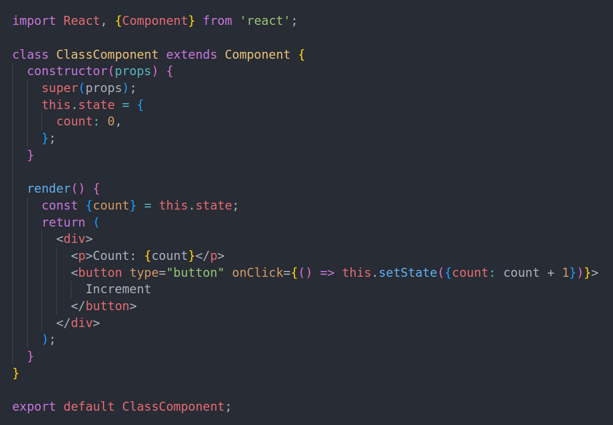
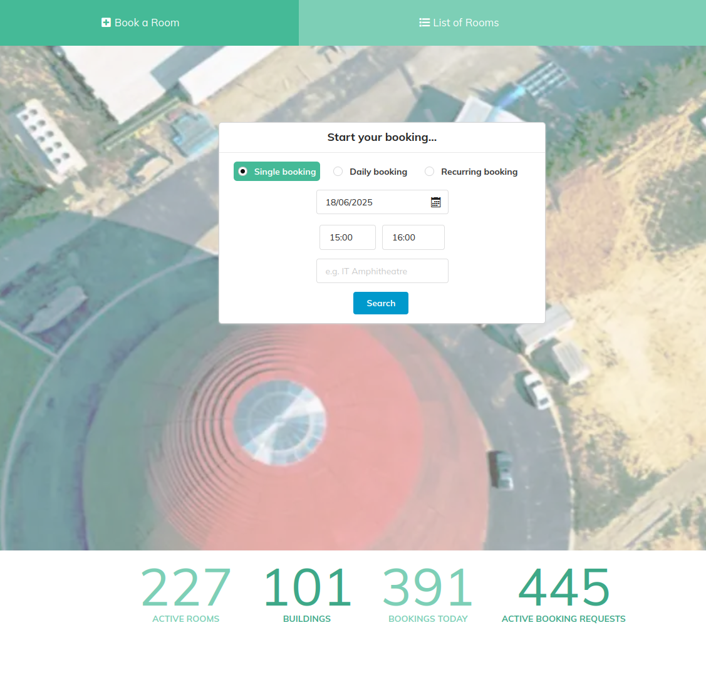
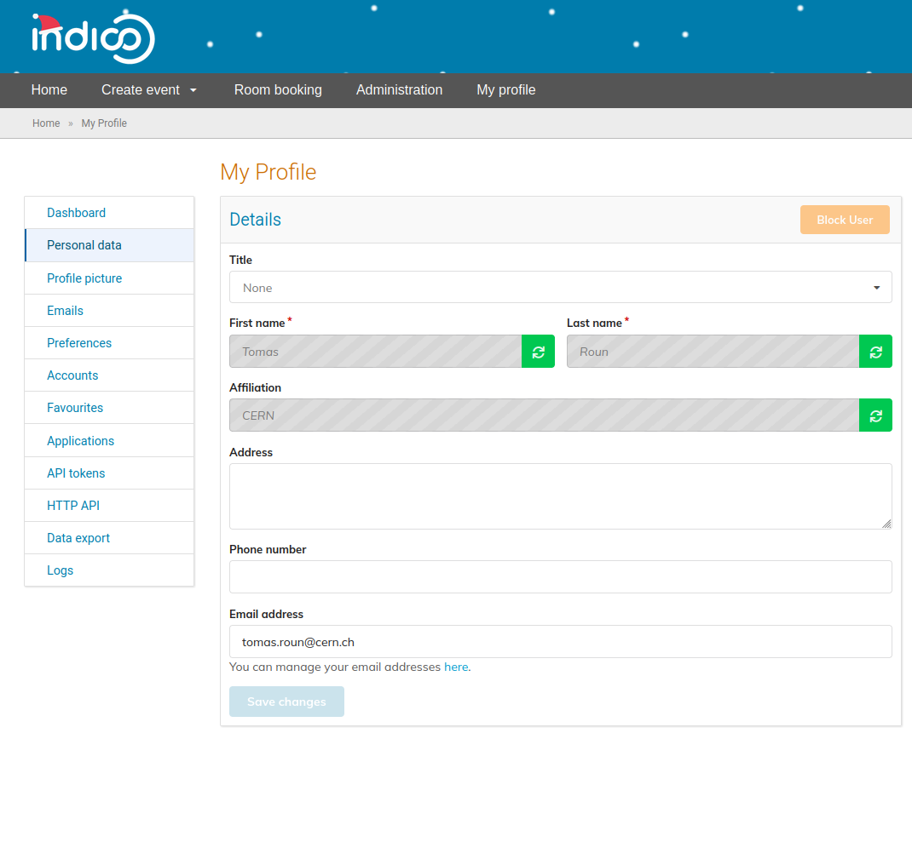
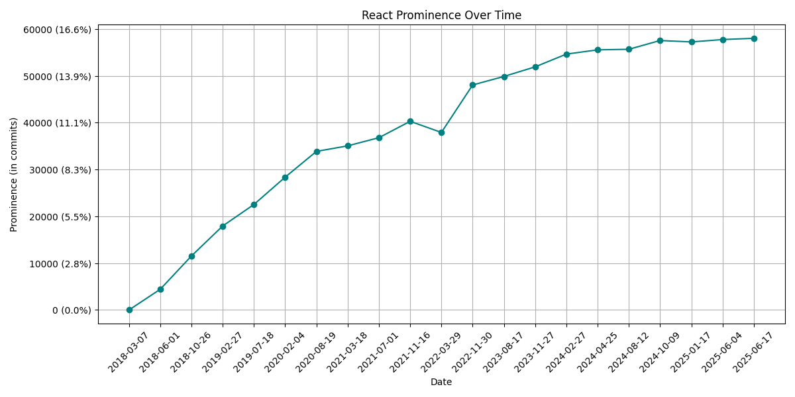

<!-- _paginate: false -->

_**Indico**: the 20 year history and evolution of an open-source project at **CERN**_

### Dominic Hollis & Tomas Roun - Indico Team (CERN)

<style scoped>
    section {
        justify-content: center !important;
        align-items: center !important;
        text-align: center !important;
    }

    h3 {
        color: #aaa;
        font-size: 0.8em;
        font-weight: normal;
    }
</style>

---

# Adopting React

<!-- Before: Jinja, reactivity handled by jQuery -->


---

<!-- "early adopters" - back when class components were the (only) standard -->



---

# Adopting React

**First steps**: Rewriting a separate module

<!-- self-contained SPA, great for testing out stuff -->
<!-- The team liked it so we decided to stick with it -->
<!-- Since then, all new features use React if possible -->
<!-- It was not possible rewrite all of Indico to React in one go, the switch is happening gradually -->
<!-- What helped a lot, is being able to mix Jinja and React on the same page -->



---

<!-- Header + sidebar rendered with Jinja, profile itself is written in React -->
<!-- React code also uses Rest endpoints returning JSON -->



---

# Jinja + React?

<!-- Jinja is used to render the header and sidebar -->
<!-- It also renders a container element with a predefined id -->

```html
<!-- user_profile.html -->
{{ render_header() }}
<div>
    {{ render_sidebar() }}
    <div id="user-profile"></div>
</div>
```

---

# Jinja + React?

<!-- The id is used by React to render inside the container element -->

```html
<!-- user_profile.html -->
{{ render_header() }}
<div>
    {{ render_sidebar() }}
    <div id="user-profile"></div>
</div>

<script>
    const container = document.querySelector('#user-profile')

    ReactDOM.render(
        <UserProfile/>,
        container
    )
</script>
```

---

<!-- Very successful adoption -->



---


 - **Event Management** System
 - **Collaborative effort** - MIT License
 - Core Developed at **CERN**
 - With contributions from the **United Nations**, **Max-Planck Institute for Physics** and many others!
 - **70+ developers** over the years

---


*The most popular event management system you never heard about*

 - **300+ servers**
 - **> 350K users**
 - Initial growth in research, but growing beyond it
   - [indico.un.org](https://indico.un.org)
   - [events.canonical.org](https://events.canonical.com/)
   - [indico.gnome.org](https://indico.gnome.org)
   - [lpc.events](https://lpc.events)

---
<!-- _backgroundColor: "#002939ff" -->
<!-- _paginate: false -->


### 🌐 [getindico.io](https://getindico.io)
###  [@getindico](https://fosstodon.org/@getindico)
###  [@getindico](https://twitter.com/getindico)
###  [#indico:matrix.org](https://matrix.to/#/#indico:matrix.org)

<style scoped>
    p {
        text-align: middle;
    }

    img {
        vertical-align: middle;
    }

    a {
        color: #ffffff;
        text-decoration: none;
    }
</style>
