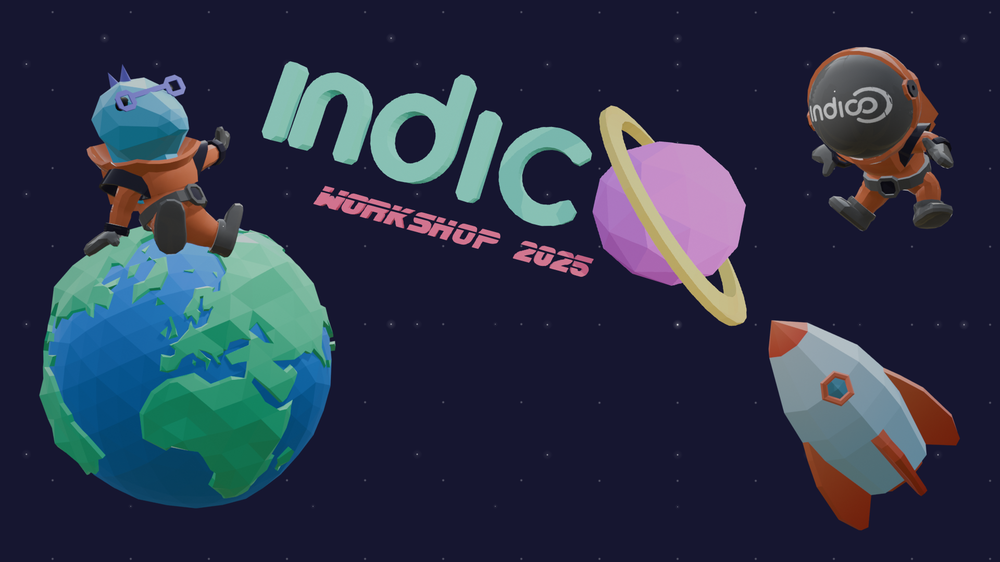
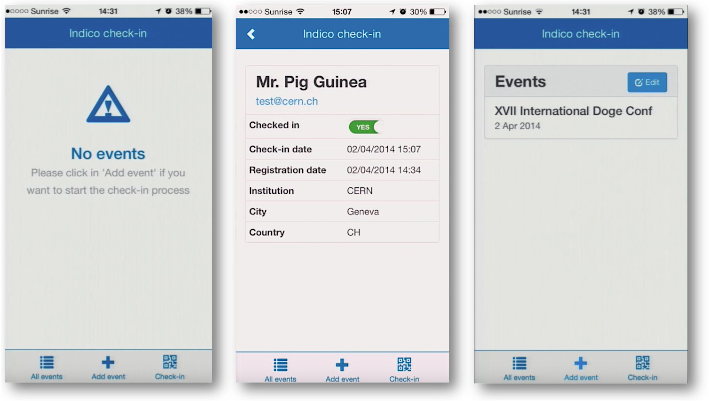
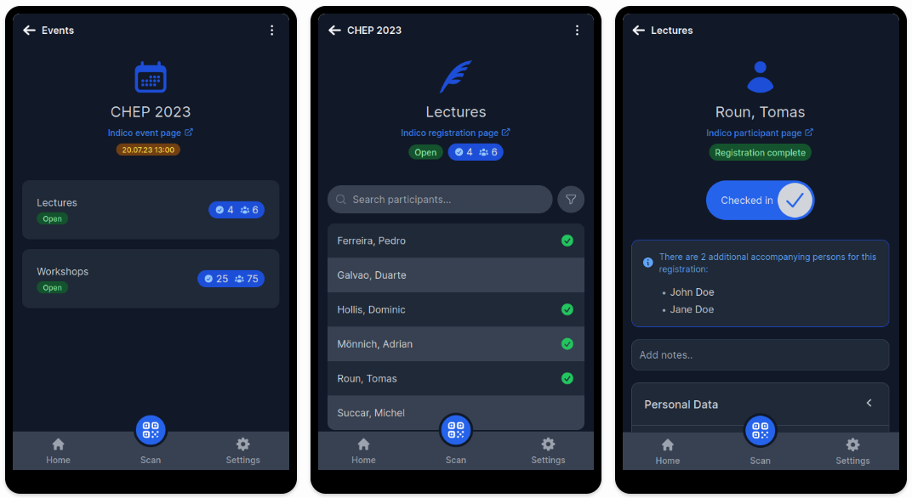
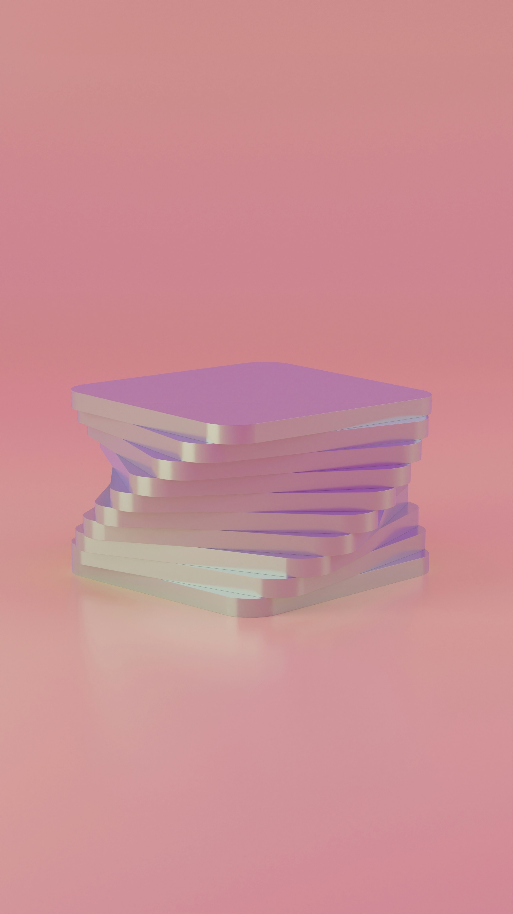
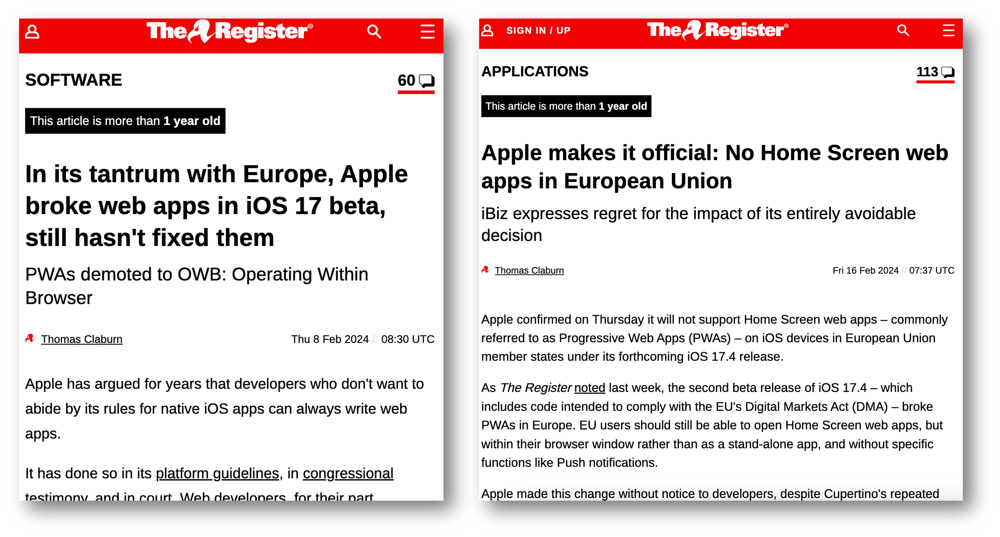
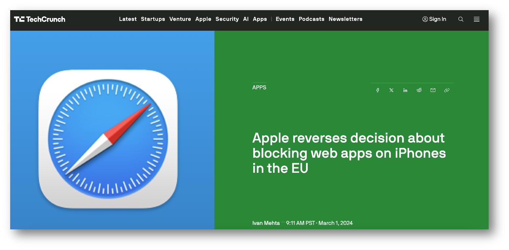

<!-- _footer: '' -->

---

*Rewriting the Indico check-in app*

### Dominic Hollis - Indico Team (CERN)

---

### What is the check-in app?

 - For organizers to check-in attendees at events
 - Used at CERN for (major) events and beyond
 - Does what it says on the tin

---

### Legacy check-in app

 - Built in 2013 (and continued to be developed till 2015)
 - AngularJS
 - Cordova to build for iOS and Android
 - Showing its age
 - Hard to maintain

---

### The legacy check-in app
🪦 2013 - 2023

<small>GPlay listing removed as of early 2024, App Store listing removed in early April 2025</small>

---

### What is a Progressive Web App (PWA)?
- PWAs are web applications that behave like native apps
- They can work offline and can be installed on devices
- Built using standard web technologies (HTML, CSS, JS)
- Provide a seamless, app-like experience across platforms

---

### The rewrite

- Idea floated in 2023
- Summer student project (João Mesquita & Tomáš Roun)
- Early ideas involved using React Native, but...
- PWA was chosen instead (more on that later)

---

### The new check-in app
https://checkin.getindico.io

---

### App Stack
- React (Typescript/TSX)
- Vite (Build)
- Tailwind CSS
- Openshift (Deployment)

---

### PWA > React Native

- Single, uniform codebase for both iOS and Android
- Lightweight, easy to develop and maintain
- No need to publish to GPlay/App Store (although, we could in theory)
- Modern PWAs are pretty great these days 👍 (mobile browsers are packing more functionality with each release)

---

### Lighthouse reporting (Chrome)

- Performance, accessibility, SEO (Search Engine Optimization) and general best practices
- Used to (roughly) test the app on different devices
- Integrated into the CI pipeline
- Helped to pinpoint issues in the PWA (e.g. getting the 'install' prompt to appear etc.)
- Some issues are not relevant to our use case (e.g. SEO)

---
### Vite

- Our replacement for the deprecated Create React App (CRA) boilerplate
- Fast, modern frontend build tool (leverages Rollup under the hood)
- Fast Hot Module Reloading (HMR) for development - changes are reflected in the browser almost instantly
- Out-of-the-box support for TypeScript, JSX, CSS and more

---

### Challenges
- Modifying Indico's API to support the new app
- Building a new UI from scratch
- Learning curve for the team
- Deprecation of React CRA (Create React App) ➡️ Vite
- Browser/Device compatibility (especially Safari/Apple in general)

---
### Apple 💔 PWAs

<small>Sources: The Register (Thomas C.) on [8 Feb. 2024](https://www.theregister.com/2024/02/08/apple_web_apps_eu/) and [16 Feb. 2024](https://www.theregister.com/2024/02/16/apple_web_apps/)</small>

---
### Apple ❤️‍🩹 PWAs

<small>Source: TechCrunch (Ivan M.) on [1 Mar. 2024](https://techcrunch.com/2024/03/01/apple-reverses-decision-about-blocking-web-apps-on-iphones-in-the-eu/)</small>

---
<!-- _backgroundColor: "#002939ff" -->

### [🌐 getindico.io](https://getindico.io)
###  [checkin.getindico.io](https://checkin.getindico.io)
###  [@getindico](https://fosstodon.org/@getindico)
###  [@getindico](https://twitter.com/getindico)
###  [#indico:matrix.org](https://matrix.to/#/#indico:matrix.org)

---

### 📷 Image sources disclaimer
Images used in this talk - apart from screenshots of the old and new check-in app, Indico/CERN logos/branding, social media logos, and press extracts from The Register and TechCrunch - are licensed under the [Unsplash License (longform below)](https://unsplash.com/license) and are free to use for commercial and non-commercial purposes.

> Unsplash grants you an irrevocable, nonexclusive, worldwide copyright license to download, copy, modify, distribute, perform, and use images from Unsplash for free, including for commercial purposes, without permission from or attributing the photographer or Unsplash. This license does not include the right to compile images from Unsplash to replicate a similar or competing service.

<small>Information correct at the time of writing (2nd May 2025)</small>
